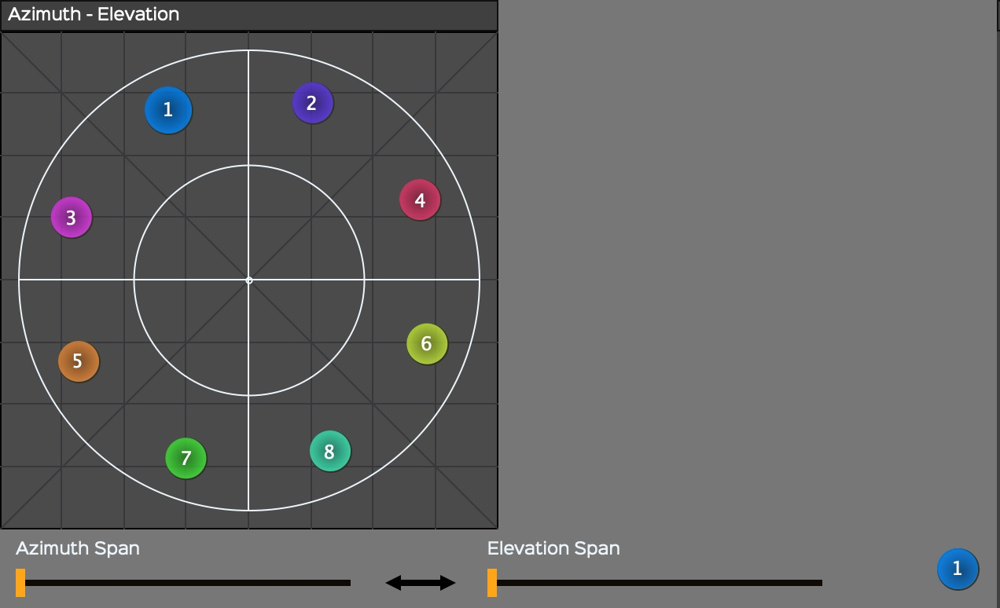
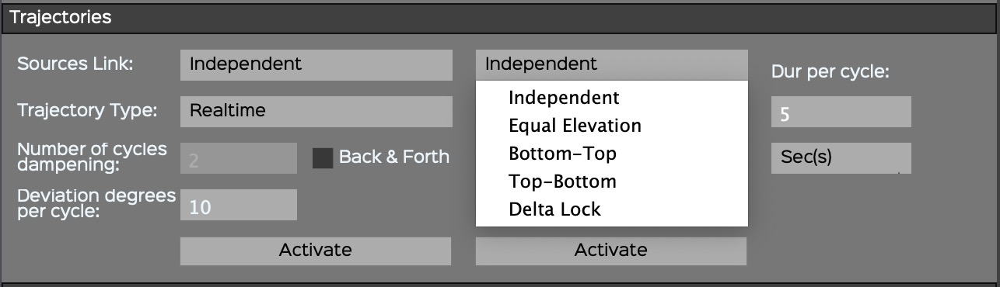
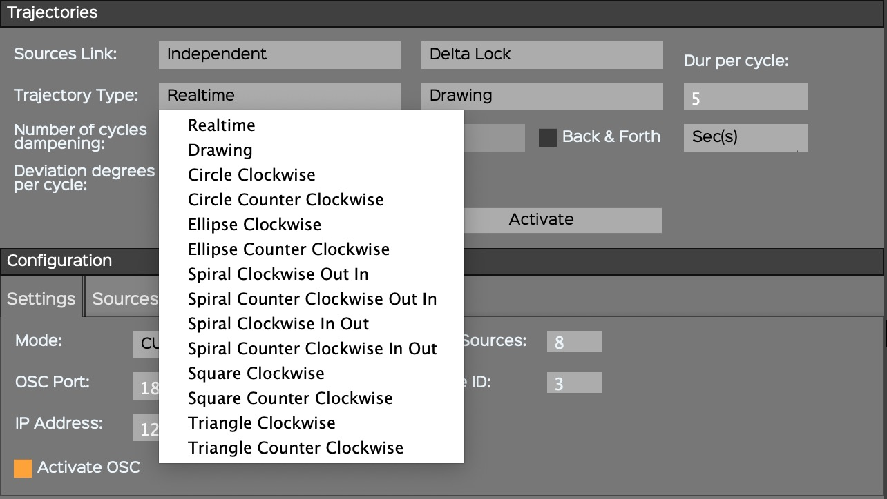
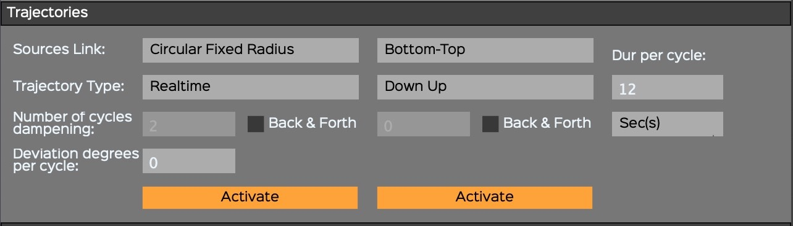

# 4. ControlGRIS2

*ControlGRIS2* is an OSC plugin that offers two possibilities, according
to the mode chosen in *SpatGRIS*:

• DOME.

• CUBE.

These two modes will be explained in detail in the *SpatGRIS* section.

## 4.1. Introduction

*ControlGRIS2* is an OSC spatialization plugin. This plugin allows movement of multichannel sound sources on a variable set of speakers. Several source-link modes and a trajectory system are provided to allow the spatialization of mono, stereo, quad, 5.1 or multichannel sources of up to eight channels. *ControlGRIS2* doesn't modify the spatialized audio, which is sent from the DAW to *SpatGRIS* via BlackHole or Jack, but it can process your track's audio for sound-reactive trajectories.

As of version 2, ControlGRIS2 also ships with a standalone version of the plugin, so you no longer need a daw to operate it. In this case you can simply route audio from your audio-generating software into SpatGRIS, and spatialize it using ControlGRIS2

This document describes the operating instructions and functions specific to *ControlGRIS2*. It is assumed that the user has a working knowledge of the host software and can perform basic functions to configure it.

## 4.2. Graphical User Interface

The graphical user interface allows for the positioning of sound sources. It is slightly different in DOME than in CUBE mode. In DOME, since the Distance is fixed at 1.00, there are only the Azimuth and Elevation parameters to adjust. In CUBE, the three parameters, Azimuth-Distance and Elevation are adjustable on two different windows.

## 4.3. Configuration panel

The configuration panel gives access to different plugin parameters.
These settings are grouped under three tabs: Sources, Settings and
Controllers.

### 4.3.1. Settings

#### MODE

The DOME mode is based on the VBAP algorithm designed by Ville Pulkki. In this mode, the space is represented by a dome where the distance between every point of the surface to the centre of the dome is equal to 1.00.

The CUBE mode is based on an original MBAP[^lbap-footnote] algorithm designed by Gaël Lane Lépine. In this mode, the space is represented by a cube within which it is possible to design any kind of speaker setup.

#### OSC Port

This is the OSC port number for communication between *ControlGRIS2* and *SpatGRIS*. They should be set to the same one. 18032 is the default value.

#### IP Address

The default value here is 127.0.0.1 which corresponds to the address of
the internal device (i.e. your computer). This can be changed to send
the OSC to an external computer.

#### Number of Sources

The number of sources per track corresponds to the number of audio
channels in the track. The number is limited to eight channels (as it is
in most DAWs).

#### First Source ID

This number must be unique and different for each audio channel. You
must use the same numbers for audio and for OSC.

If you have only mono tracks, the numbers are successive. If you have
stereo tracks, you'll have only odd numbers to put here: 1, 3, 5, etc.
because the even numbers are set automatically to the right channel of
each stereo track. And if you work with octophonic sound files, the
first source ID will be 1, the second octophonic track will start at 9,
etc.

### 4.3.2. Sources

Under the Sources tab, it is possible to accurately position sources by using the graphical interface or the text boxes. Using Sources Placement, it is possible to position sources equidistantly, following a clockwise or alternate order. To do so, simply select the desired layout from the drop-down menu.

Moreover, it is possible to manually adjust the position of each source by entering its polar (DOME) or Cartesian (CUBE) coordinates. From the Source Number drop-down menu, first select the number of the source to be moved. Then, enter its new coordinates.

In DOME, Elevation and Azimuth correspond to the current polar coordinates of the selected source:

In CUBE, X, Y, and Z correspond to the current Cartesian coordinates of the selected source:

*NOTE: Manual positioning of individual sources only works when the Independent mode is chosen under Sources Link.*

It's also possible to position all sources to match a specific SpatGRIS speaker setup, so that you have one source positioned exactly on each speaker in your setup. To do so, use the folder icon in the Source tab section, and select the speaker setup you want to load.

### 4.3.3. Controllers

*ControlGRIS2* can be manipulated via an external Open Sound Control[^osc-footnote]
(OSC) controller. There is an interface made for Open Stage Control and
one made for Lemur to manipulate *ControlGRIS2* parameters from an
iPad[^ipad-footnote].

• OSC output plugin ID: to control different instances of *ControlGRIS2*,
each one should have a different ID.

• Receive and Send should be set accordingly to the proper OSC channels
(Default: 9000 and 8000).

• IP port addresses should be set accordingly to your Wi-Fi network,
either public or local[^openstagecontrol-footnote]. Both the computer and the controller should
be on the same network. *ControlGRIS2* automatically receives the input
address from your network.

## 4.4. Spatialization views

*ControlGRIS2* works in two different modes for sound spatialization:
DOME and CUBE.

### 4.4.1 View in DOME mode

In DOME mode, the graphical interface is limited to Azimuth-Elevation.
In this mode, the sound is spatialized on the surface of the dome.
Whereas a source placed in the centre is at the top of the dome, a
source placed at the periphery is at the bottom of the dome.

The dome is represented here from the top, examples with a stereo source
on the left, an octophonic source on the right:

### 4.4.2. Spans in DOME mode

In both modes, Span parameters are available for azimuth and elevation.
Span spreads the signal to a larger zone than just the source itself. In
DOME mode, the spans look like an arc on each side of the source:

### 4.4.3. View in CUBE mode

In CUBE mode, the graphical interface is divided between two screens:
Azimuth-Distance and Elevation. The CUBE mode adds distance and allows
moving a sound inside or outside the speaker setup (represented by the
internal white square). The CUBE is represented from the top on the left
and in profile on the right (the 3D view shows only in *SpatGRIS*).
Examples for stereo and octophonic sources:

### 4.4.4. Spans in CUBE mode

In CUBE mode, the spans look like a cylinder wrapped around the source:

In some CUBE setups, where most speakers are spread across the walls and
the ceiling, a source can be lost in the centre of the hall. If you wish
to create a flat sound disk that activates only the speakers located at
the same height as the source, you can add a bit of Azimuth Span:

### 4.4.5. CUBE Elevation in Normal or Extended Top mode

Since version 1.4.1, *ControlGRIS2* offers the possibility to put a
source outside of the CUBE in elevation. This was already possible on
the *x* and *y* axes, and it is now possible on the *z* axis. When using
the Extended Top mode, a white horizontal line appears in the elevation
diagram. This line represents the value 1.0 used in the Normal mode.
This is the point at with *SpatGRIS* Attenuation Settings start to take
effect in elevation. Sources will be filtered either in volume and/or in
frequencies as they move further away from the top of the cube:

### 4.4.6. CUBE Elevation in Extended Top and Bottom mode

A second line appears in Extended Top and Bottom mode to attenuate the
sounds that are sent below the floor (for the lucky few who have access
to a full cube!) The top line represents the value 1.0 of the normal
mode. The bottom line represents the value 0.0 of the Normal mode:

NOTE 1: Older projects can still be used in the Normal mode where the
full range from 0.00 to 1.00 is still available.

NOTE 2: It's not yet possible to go below the floor in a complete sphere
with ControlGRIS2 in DOME mode. We are working on that. But it's possible
to do so by using any software that sends OSC directly to SpatGRIS.

## 4.5. How to use ControlGRIS2

*ControlGRIS2* is a plugin that can be inserted on any track that
requires spatialization. *ControlGRIS2* comprises a trajectory system
that can write predefined movements quickly and efficiently. The
automation function of the host software assures the recording and
playback of the source's movements. It is therefore essential to
understand the various automation modes in your preferred host.

### 4.5.1. Load the plugin on a track

*ControlGRIS2* is loaded similarly to any other AU or VST plugin. Most
often, *ControlGRIS2* is loaded at the end of the insert chain of the
track.

NOTE: In each track of the DAW, it’s mandatory that the audio output
numbers match the OSC numbers (set by the First Source ID parameter) in
the corresponding ControlGRIS2 to have the sound to be spatialized in
SpatGRIS. Not doing that will lead to silence, or to freeze
spatialization.

### 4.5.2. Save presets and recording automation

It is possible to save some of the *ControlGRIS2* plugin parameters in the 50 provided preset slots. The shortcuts are:

* Shift-Click Preset number: Save.
* Click Preset number: Load.
* Opt[^opt-alt-footnote]-Click Preset number: Delete.

These functions appear below the rows 49-50:

The presets allow you to save and recall only the following parameters:

* Source positions (Azimuth-Distance-Elevation). These can also be
automated.
* First Source ID.
* Number of Sources.

The parameters that are not saved but can be automated:
* Spans.
* Sources Link and Sources Link Alt.
* Presets.
* Bypass.

The parameters that are not saved and not automated, because they are
used to automatically generate a trajectory that will be written by the
DAW itself:
* Spans link.
* Trajectory Type.
* Dur per cycle.
* Sec(s)/Beat(s).
* Number of cycles dampening.
* Deviation degrees per cycle.
* Back & Forth.
* Activate.

Configuration tab
* The whole Configuration tab is not saved in the preset (this one is
saved with the DAW project). It is not a good idea to change these
settings within a track.

*NOTE: While it is possible to record the position of all sources in
presets, it is only possible to record the automation of the source No.
1 in the DAW. Source No. 1 is the leader while other sources are
followers.*

### 4.5.3. Recall presets

As mentioned above, the presets store only the position of the sources.
When a preset is loaded, the sources are positioned according to the
stored data. Keep in mind though that the sequencer also has a memory of
the previous position of the sources, and both can interact strangely.
Very often then, it's only when you start the sequencer that the sources
take their real positions. To avoid any ambiguity, presets selection can
be automated.

## 4.6. Trajectories

It is possible to automate the movement of sound sources using
predefined trajectories. Within the Trajectories control panel, you can
set and adjust these movements to the musical context. The concept
behind the trajectories is that there is a source leader while the
others are followers. Only the source No. 1 can be the leader.

If you try to record the automation of any other source than No. 1,
you’ll get this warning:

### 4.6.1. Sources Link

Independent mode is only available for initially placing sources
independently in a multichannel track. But the position of sources can't
be automated independently. Only the automation of the Source No. 1 can
be recorded. Therefore, after placing the sources, a different source
link should be chosen before recording the automation.

#### Azimuth-Elevation (DOME) and Azimuth-Distance (CUBE) Links

Within the *Trajectories* section, under the *Sources Link* drop-down
menu, it is possible to choose different ways of linking sources
together. Depending on the number of channels, some links may not be
available:

• Mono: Independent only.

• Stereo: all links.

• Multichannel: all but Symmetric X and Y.

• Detailed representations of the Azimuth-Elevation and Azimuth-Distance
Links are shown at the Addendum 8.1.1.

#### Elevation Links (CUBE mode only)

In CUBE mode, the Elevation Links between sources are independent from
the Azimuth-Distance parameters.

• Detailed representations of the Elevation Links are shown at the
Addendum 8.1.2.

### 4.6.2. Trajectory Type

Automating the movement of a source is quite simple with the different
trajectory types provided.

• Detailed representations of the Trajectories are shown at the Addendum
8.2.

#### Azimuth-Elevation (DOME) and Azimuth-Distance (CUBE) Trajectory Type

A drop-down menu allows you to select from different types of
trajectories such as *Circle*, *Ellipse*, *Spiral*, *Square* and
*Triangle,* either in *Clockwise* or *Counter Clockwise* mode.

#### Elevation (CUBE only) Trajectory Type

A drop-down menu with different types of trajectories allows you to
select from a variety such as *Up Down*, *Down Up.*

#### Other settings

• The duration of the trajectory in *second(s)* or *beat(s)* (linked to
the MIDI tempo of the host sequencer).

• The Number of cycles dampening: the total duration = Dur per cycle x
Number of cycles x 1,5. Dampening works only with Back & Forth.

• The Back & Forth option.

• The Deviation degrees per cycle.

#### Realtime

This is the usual automation recording: you move a parameter (or several
parameters) and it is recorded in the DAW.

#### Drawing

The Drawing mode allows you to draw a trajectory directly into the
plugin itself. This trajectory can then be modified by editing the
duration, dampening and deviation. When the desired settings are found,
they can be recorded in the DAW itself.

The Drawing mode is a freehand mode. When you select it, a light grey
cross will appear with which you draw a trajectory. The timing of the
trajectory and the design are temporarily stored within the plugin. In
Azimuth-Elevation (DOME) or Azimuth-Distance (CUBE), it's the position
that is recorded. In Elevation (CUBE only) it's the position over time.
Both windows share a cycle that can be modified with the regular
parameters. To see the trajectory in action, you can turn on the
Activate buttons and play the sequence. When the sequencer stops, the
Activate buttons return to off. Changes can be made and then it's
possible to switch on Activate again. Once satisfied with the results,
you can then record the trajectory in the DAW.

#### Shift-Click in Drawing mode

If Shift is pressed in the Drawing mode, it's possible to design
straight lines or irregular geometrical figures in the Azimuth-Elevation
(DOME) or the Azimuth-Distance (CUBE) window. Every time you click, a
new angle is created. Don't forget to click one last time once you’re
finished!

**NOTE: Be careful with the freehand trajectory because it’s temporary.
If you click anywhere in the window after drawing a trajectory, or close
the plugin or the session, it will automatically be erased. Only one
gesture can be temporarily recorded at a time. The X cross can be hidden
behind one of the sources. Just move one of those to find it back.**

#### Activate

Pressing the Activate button makes *ControlGRIS2* wait for the start of
the sequencer. When the sequence is initiated, the plugin will start the
trajectory according to the specified settings. The movement produced
can be recorded — X, Y and Z-coordinates of the source No. 1 — like any
other automation. When the sequencer stops, the *Activate* buttons
return to off. It's important to put the play head at the right position
before pressing on the activate button and putting the sequence into
play.

#### Trajectory recording in the DAW

As explained above, *ControlGRIS2* waits for the host sequencer to start
before starting a trajectory. The tracks that contain *ControlGRIS2* can
be set in a write mode (Touch, Latch, or Write — depending on the
options within your DAW) to record the sources' movements as automation.
This automation is then available for playback and editing.

NOTE: Only the source No. 1 (leader) is recorded, the other sources
being followers. It is always preferable to record the automation of
trajectories in the DAW after you have found the right settings, because
it frees up the CPU used by ControlGRIS2.

### 4.6.3. A special case: the pendulum

A specific use of the Shift-Click in Drawing mode can be used to design
a pendulum. If a simple line is drawn with Shift-Click, it constitutes
the basic element of a pendulum. Then the Dur per cycle, Dampening,
Deviation and Back & Forth can be used to make this pendulum very
interesting. It can be placed anywhere in the space.

### 4.6.4. Presets and automated trajectories

It's possible to record the presets selection in the sequencer. But to
avoid contradictory information between automated trajectories and
automated presets (which stores x-y position of the sources), in
automation recording, the x and y coordinates, registered in the preset,
will be automatically written in the x-y automation curves. The
automated presets are designed essentially to offer the possibility to
apply sudden changes in the position of the sources.

NOTE: Be careful with that. If you overwrite the already existing X and
Y automations, they might become in competition with the information
stored in the presets. Then you will certainly get audio glitches.

## 4.7. Sound-reactive trajectoiries

The main new feature in ControlGRIS2 is the possibility to generate trajectory from the analysis of the audio signal that we want to spatialize.

[^lbap-footnote]: Since version 3.2.0, the LBAP, Layer Base Amplitude Panning, designed by Olivier Bélanger, is not in use anymore.
[^osc-footnote]: http://opensoundcontrol.org
[^ipad-footnote]: See the Addendum manual for more information.
[^openstagecontrol-footnote]: See the Open Stage Control manual for that: <https://openstagecontrol.ammd.net/>
[^opt-alt-footnote]: On the Mac, most keyboards use Option (Opt), while others use Alt. Opt will be used in this manual.
