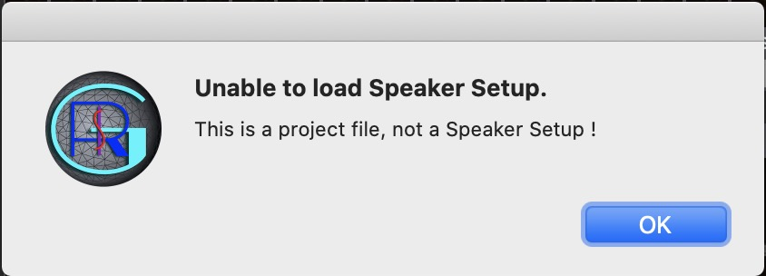
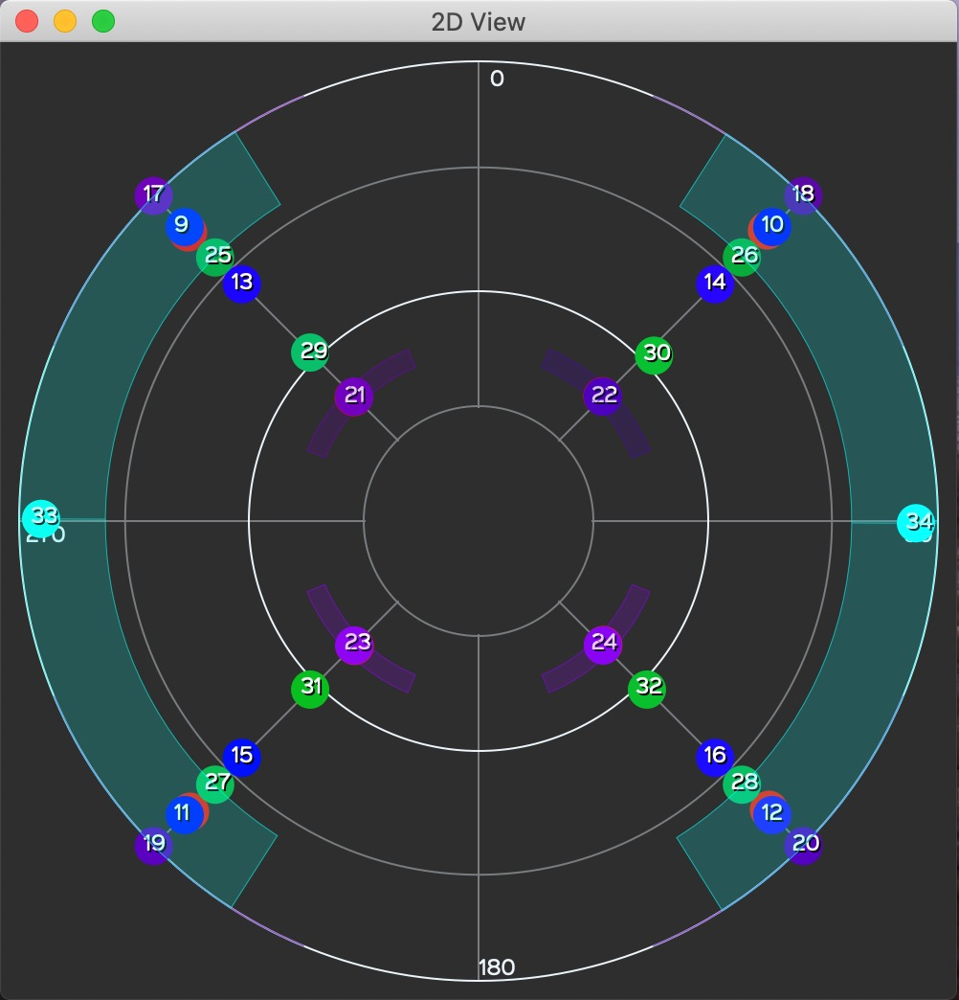

# 7. Menus

## 7.1. File menu

In the File menu you will find all the project-related functions, where
you can:

• Create a New Project.

• Open an existing one.

• Open a project from the Project Templates folder. These templates
can’t be modified but they can be edited and saved as a new file.

• Save Project or Save As — make a copy.

• Open a speaker setup.

• Open a speaker setup from the Speaker SetupTemplates folder. These
templates can’t be modified but they can be edited and saved as a new
file.

• Save Speaker Setup or Save As — make a copy.

• Open the Settings window.

## 7.2. View menu

Under the View menu, you can choose from different perspectives to
visualize the speakers and sources in real time. The key modifier in
this menu is Option (Opt) for Mac and Alt for Windows.

• Show 2D view: A 2D view from
the top of the space is given showing only the sources.

• Speaker Setup Edition: Opens a window to access all the given
parameters for a valid configuration of speakers.

•Show Player View: open the Player window

• Show OSC monitor: for specialists! To help troubleshoot incoming OSC
message streams.

• Show SpeakerView: open the 3D view of the speakers

—

Keep SpeakerView On Top

—

• Show Hall: show the walls of the hall

• Show Numbers: Show or hide the numbers of the displayed sources and/or
speakers.

• Show Speakers: Show or hide the speakers in the 3D view.

• Show Speakers Triplets: Show or hide the triplets in the 3D view in
DOME mode. There are no triplets in CUBE mode.

• Show Source Activity: This option allows to see the position and
trajectories of the sources (large points) and their values for Azimuth
and Elevation Span (small points), according to the data sent by the
*ControlGRIS* plugin. Note that there is nothing to see when the DAW is
stopped. The threshold is set at -70 dB. When this option is not
selected, all sources that are part of a project are displayed, even
when the DAW is stopped. This option can be useful for checking that
there are no duplicate OSC channels sent from *ControlGRIS* to
*SpatGRIS*.

<table>
<colgroup>
<col style="width: 46%" />
<col style="width: 53%" />
</colgroup>
<thead>
<tr class="header">
<th><em>Show Source Activity</em> Off: shows the position of all the
sources</th>
<th><em>Show Source Activity</em> On: shows only the real activity of
the sources in play mode</th>
</tr>
</thead>
<tbody>
</tbody>
</table>

• Show Speaker Level: Shows how much energy each speaker delivers. From
grey (nothing) to white (maximum).

• Show Sphere/Cube: If you have the chance to play in a full sphere or
cube!

—

• Colorize Sources: This option allows you to set all the inputs to a
different colour within the visible spectra from red to purple. Be
careful, it erases all the custom colours already in place.

• Reset Sources Position: When switching from a project to another,
*SpatGRIS* could still show the sources from the previous project. Use
this option to clear up the 3D view.

• Reset Meter Clipping: clipping indicators can be reset individually by
clicking on them, or globally with Opt-M shortcut.

## 7.3. Naming and Saving

There are three sections in *SpatGRIS* that are saved independently:
Project, Speaker Setup and Settings.

• Save Project. A project is coupled with a work.

• Save Speaker Setup. A speaker setup is coupled to an installation
placed in a space.

• Save Settings. User settings are linked to a workstation — computer
and audio interface — including the stereo outputs used for stereo
reduction (even without showing it)

• Save Settings. The stereo outputs are coupled to a specific audio
interface.

Speaker setups and Project documents are saved under the .xml format.
There is no distinction between them. The Project document doesn't
include the speaker setup and they are therefore independent.
Consequently, we strongly recommend two things:

• Add the word "Speaker Dome" or " Speaker Cube" to the name of your
speaker setups and "Project Dome", "Project Cube" or "Project Hybrid" to
the name of your project files.

• Save the DOME or the CUBE speaker setups in two separate folders in a
folder named *Speaker*s.

• Save *SpatGRIS* projects in three separate folders inside a folder
named *Projects.*

The Templates menus we provide with *SpatGRIS* is a good example of the
right classification.

• Document format warnings

*SpatGRIS* always remembers the last opened speaker setup and the last
project.

If you try to open a *SpatGRIS* project with the command Load Speaker
Setup (or the opposite), you'll be warned:

NOTE: SpatGRIS documents adopt a new format and are not backward
compatible with older versions of SpatGRIS. By trying to open a SpatGRIS
project or a speaker setup from the version 2, you’ll get one of these
scary messages! Your files are OK, just not compatible:

## 7.4. Representations

The 3D and 2D views in *SpatGRIS* are available for both DOME and CUBE
modes. The sources on the DOME are on the surface and the Spans spread
along that surface. In CUBE mode, the sources can be placed anywhere in
the space and the Spans spread locally around the sources.

### 7.4.1. 3D Representation

The 3D window in DOME mode (left) or in CUBE mode (right) of the same
session. Speakers and Sources are represented:

### 7.4.2. 2D Representation

The 2D view in DOME mode (left) or in CUBE mode (right) of the same
session. Only Sources are represented:

## 7.5. Performance and CPU burst

The performance of the *ControlGRIS*/*SpatGRIS* combination largely
depends on the different settings in your project. As a rule, a project
with 64 audio channels sent to 64 speakers will work perfectly well on
recent computers. We have tested projects with more than 100 audio
channels over a 256-speaker setup and that was still working well!

The factors which will significantly augment the CPU usage needed by our
tools are, in order of importance:

• The Mode: CUBE is more demanding than DOME, since the former uses more
speakers than the latter.

• The Spans: they distribute the signal to more speakers than when they
are not in use, and therefore the CPU demand increases very rapidly as
their values increase.

• The Interpolation: the interpolation factor helps some sounds to
achieve a more fluid transition time as they move from one place to the
next. Therefore, the higher this parameter, the higher the number of
speakers involved in the process, since a sound will reach a given
speaker earlier and take more time to leave it (not to mention, it also
blurs the localization).

• The number of speakers used in *SpatGRIS*. We measured comfortable
performance with a 96-speaker setup, which is largely enough in most
realistic situations!

• The number of tracks multiplied by the number of speakers determines
the reliability of the setup. Few tracks over a big speaker setup will
give the same result as many tracks over a small speaker setup.

If the CPU overpass 100%, this is the warning you'll get this alert:

Want to know what to expect? Try it for yourself!

## 7.6. Help Menu

The Help menu comprises information about the GRIS and this manual,
under the Open Documentation option.

**Take the plunge and have fun!**
