# 8. Addendum

## 8.1. Sources Link descriptions

### 8.1.1. Azimuth-Elevation and Azimuth-Distance

<table>
<colgroup>
<col style="width: 100%" />
</colgroup>
<thead>
<tr class="header">
<th><strong>1) Independent</strong> MONO + STEREO + MULTIPHONIC</th>
</tr>
</thead>
<tbody>
<tr class="odd">
<td>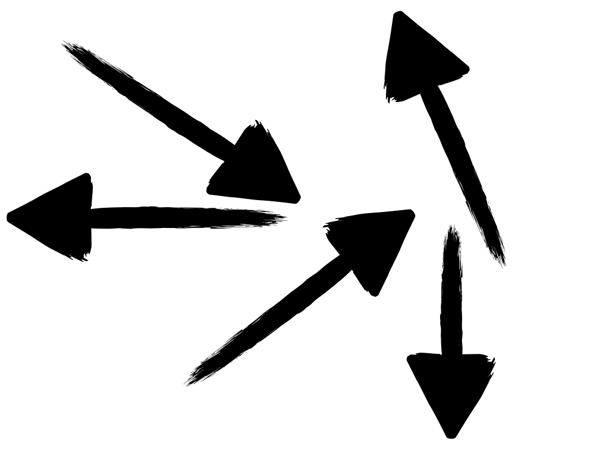This mode is selected by default.
The sources can be moved independently from one another.</td>
</tr>
<tr class="even">
<td><strong>2) Circular</strong> STEREO + MULTIPHONIC</td>
</tr>
<tr class="odd">
<td>
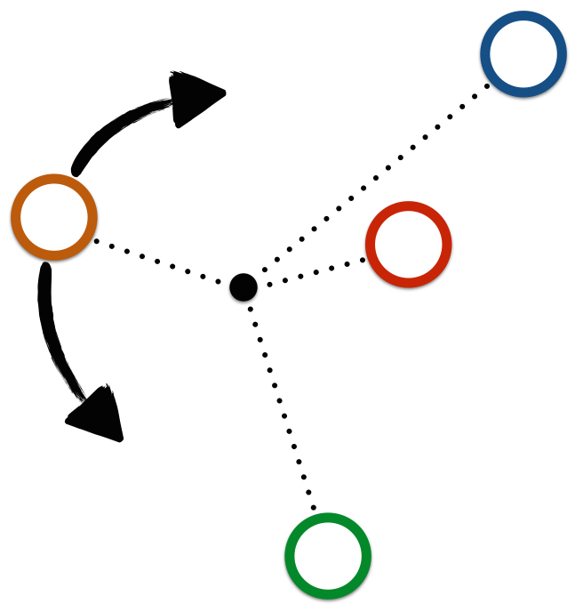This mode enables the circular
grouped movement. The angles between the sources remain constant while
the radius adjusts proportionally.

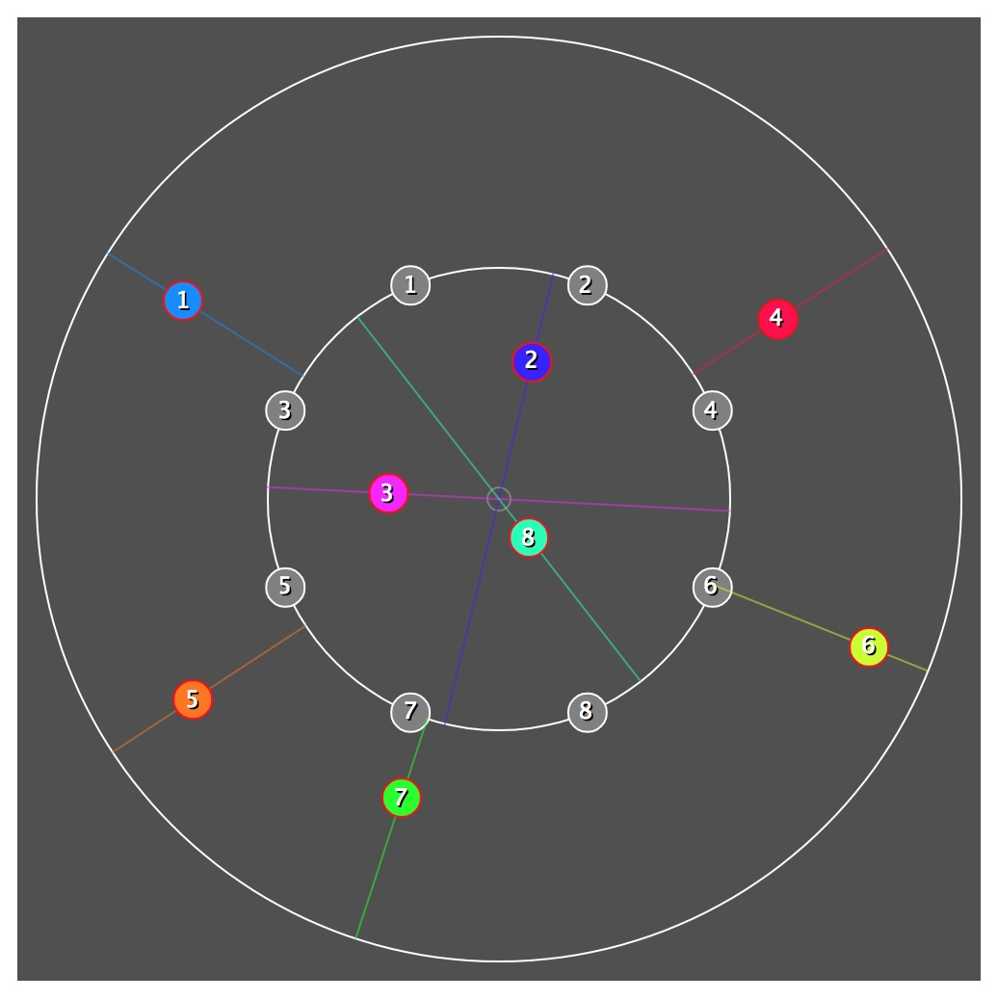
</td>
</tr>
<tr class="even">
<td><strong>3) Circular Fixed Radius</strong> STEREO + MULTIPHONIC</td>
</tr>
<tr class="odd">
<td>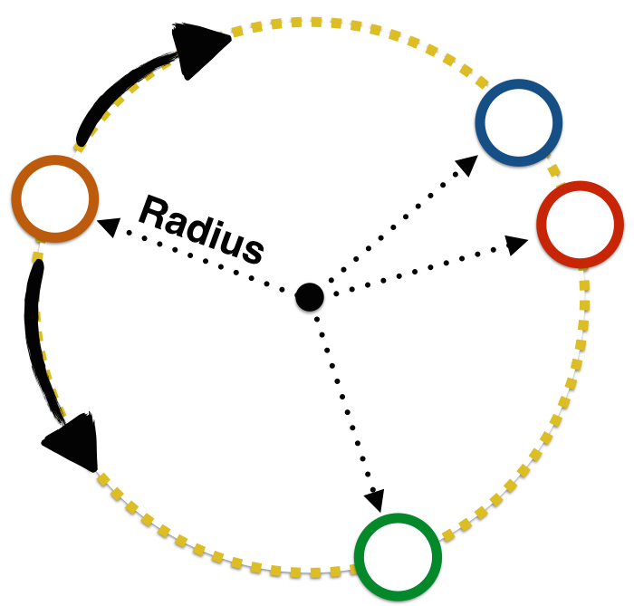The sources are linked in a
circular motion by the Radius parameter, which remains fixed and equal.
The relative distance between each source and the centre is the same for
all sources.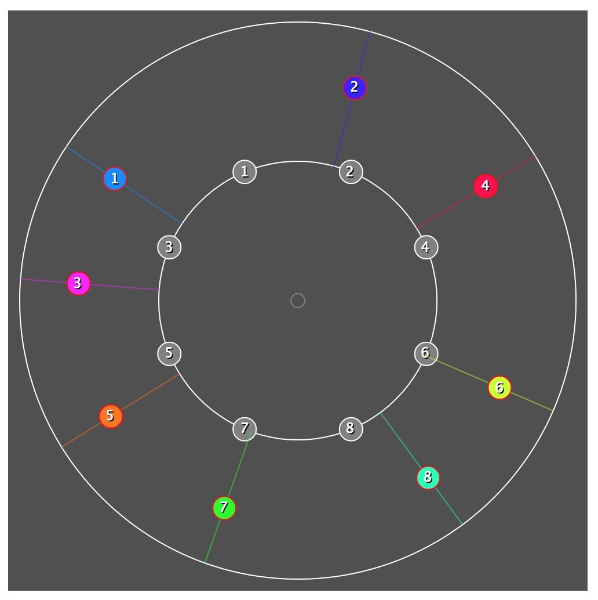</td>
</tr>
<tr class="even">
<td><strong>4) Circular Fixed Angle</strong> STEREO + MULTIPHONIC</td>
</tr>
<tr class="odd">
<td>
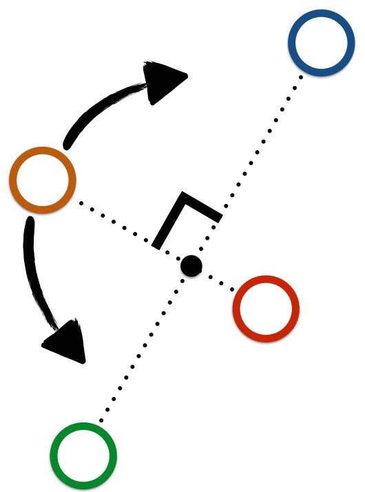The sources are linked in a
circular motion with the Angle parameter, which remains fixed and
equal.

For example, in octophony the opening angle between each of the
sources will be fixed to 45°.
</td>
</tr>
<tr class="even">
<td><strong>5) Circular Fully Fixed</strong> STEREO + MULTIPHONIC</td>
</tr>
<tr class="odd">
<td>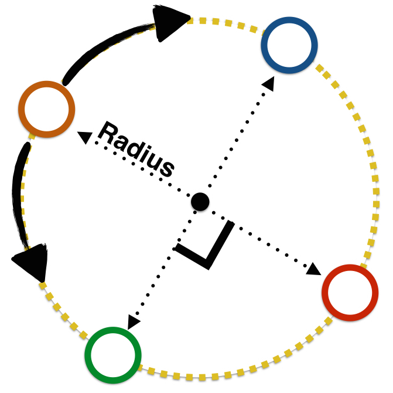The sources are linked in a
circular motion by both the Radius and Angle parameters, which remain
fixed and equal. The opening between the sources and their radius is
therefore always identical.</td>
</tr>
<tr class="even">
<td><strong>6) Delta Lock</strong> STEREO + MULTIPHONIE</td>
</tr>
<tr class="odd">
<td>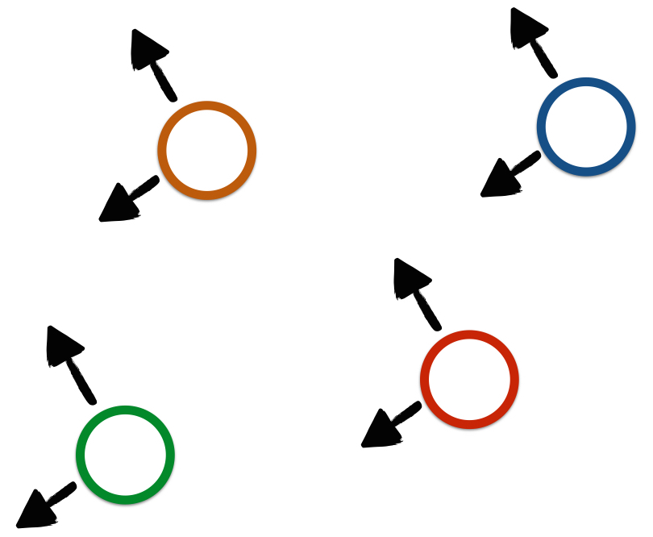This mode locks the position of the
sources in relation to others along the X and Y axes, without the
possibility of rotation.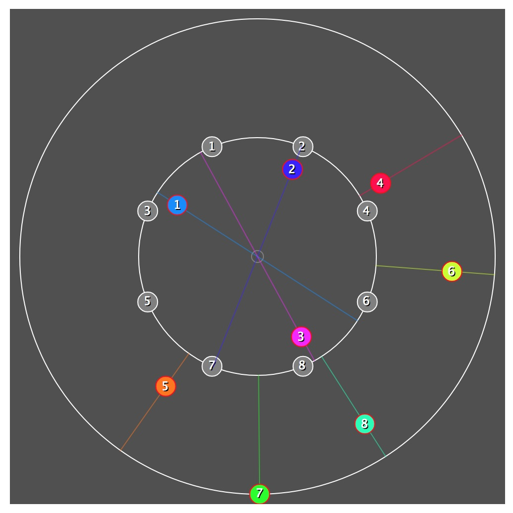</td>
</tr>
</tbody>
</table>

<table>
<colgroup>
<col style="width: 100%" />
</colgroup>
<thead>
<tr class="header">
<th><strong>7) Symmetric X</strong> STEREO</th>
</tr>
</thead>
<tbody>
<tr class="odd">
<td>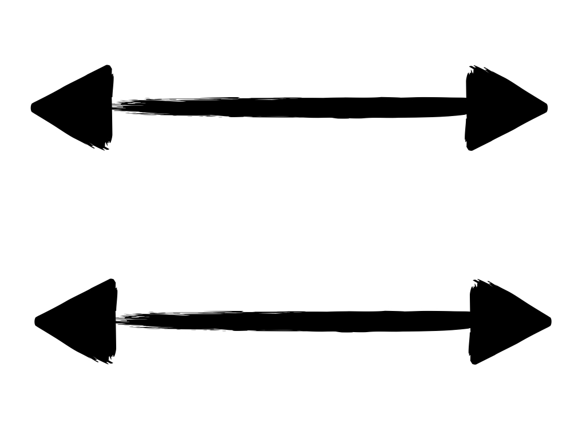This mode enables the symmetry
between two sources following the X axis.</td>
</tr>
<tr class="even">
<td><strong>8) Symmetric Y</strong> STEREO</td>
</tr>
<tr class="odd">
<td>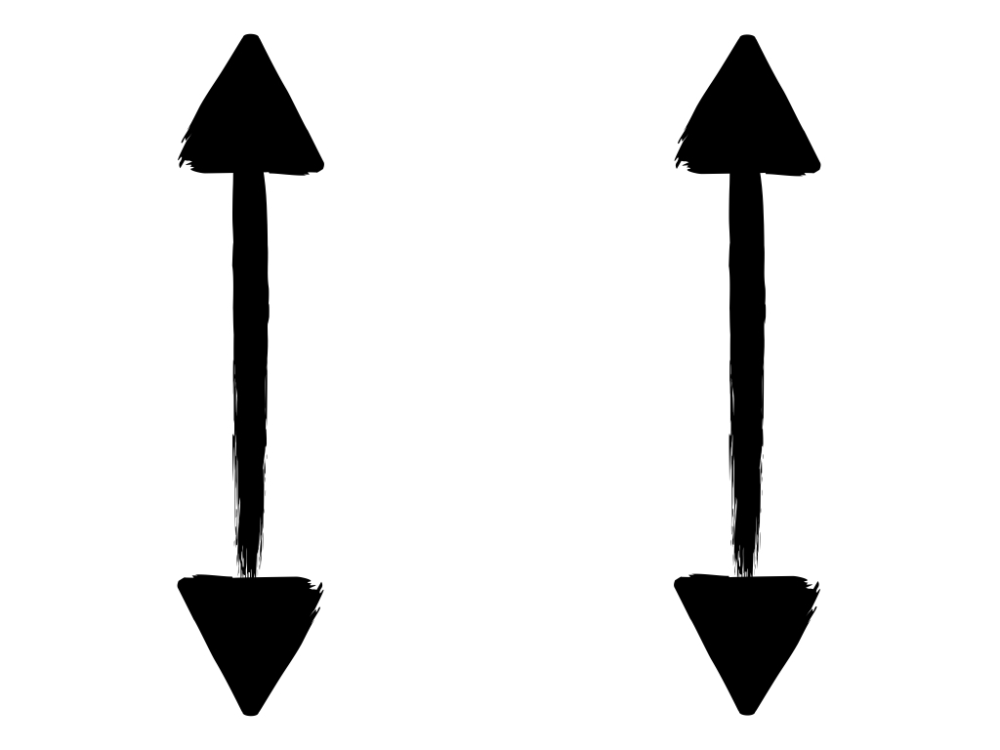This mode enables the symmetry
between two sources following the Y axis.</td>
</tr>
</tbody>
</table>

### 8.1.2. Elevation (CUBE mode only)

<table>
<colgroup>
<col style="width: 100%" />
</colgroup>
<thead>
<tr class="header">
<th><strong>1) Independent</strong> MONO + STEREO + MULTIPHONIC</th>
</tr>
</thead>
<tbody>
<tr class="odd">
<td>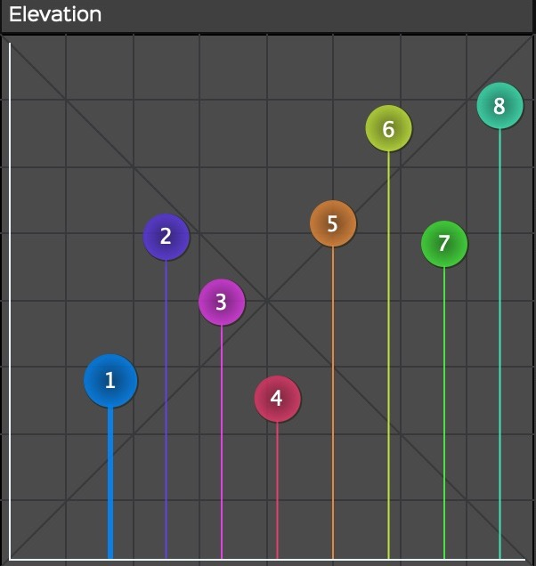 This mode is selected by default.
The sources can be moved independently from one another.</td>
</tr>
<tr class="even">
<td><strong>2) Fixed Elevation</strong> STEREO + MULTIPHONIC</td>
</tr>
<tr class="odd">
<td>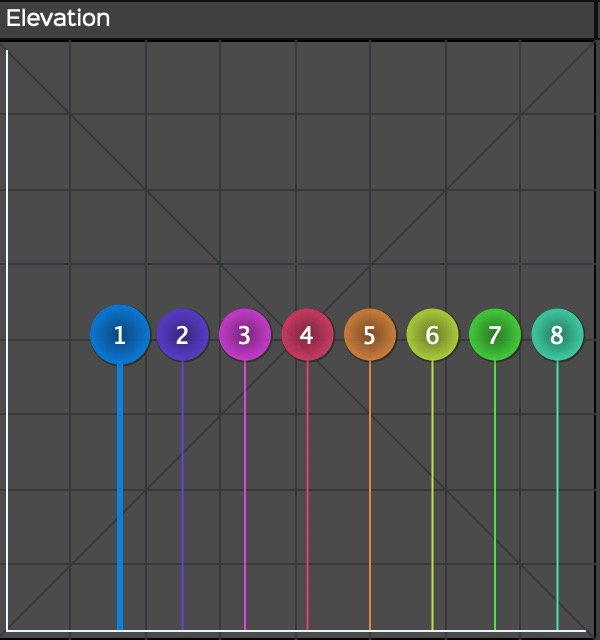Same elevation for each source.</td>
</tr>
<tr class="even">
<td><strong>3) Bottom Top</strong> STEREO + MULTIPHONIC</td>
</tr>
<tr class="odd">
<td>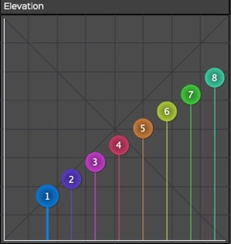This mode locks the position of the
sources from a minimum to a maximum value in a linear relationship.</td>
</tr>
<tr class="even">
<td><strong>4) Top Bottom</strong> STEREO + MULTIPHONIC</td>
</tr>
<tr class="odd">
<td>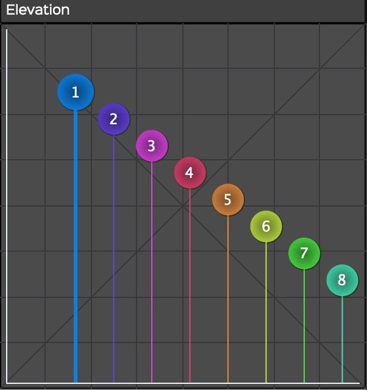This mode locks the position of the
sources from a maximum to a minimum value in a linear relationship.</td>
</tr>
</tbody>
</table>

<table>
<colgroup>
<col style="width: 100%" />
</colgroup>
<thead>
<tr class="header">
<th><strong>5) Delta Lock</strong> STEREO + MULTIPHONIC</th>
</tr>
</thead>
<tbody>
<tr class="odd">
<td>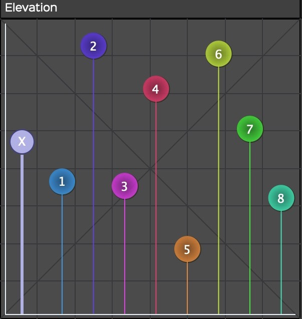This mode locks the position of the
sources in relation to others.</td>
</tr>
</tbody>
</table>

## 8.2. Trajectory descriptions

### 8.2.1. Azimuth-Elevation and Azimuth-Distance

<table>
<colgroup>
<col style="width: 100%" />
</colgroup>
<thead>
<tr class="header">
<th><strong>1) Circle</strong></th>
</tr>
</thead>
<tbody>
<tr class="odd">
<td>
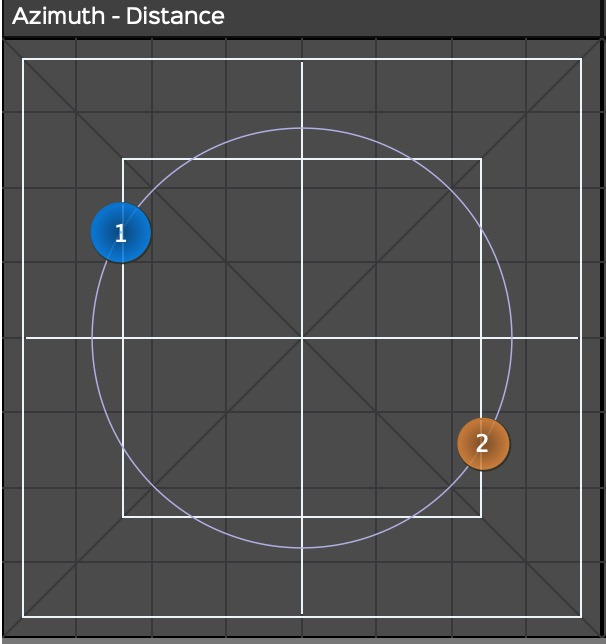Circular motion around the
centre.

Options: CW/CCW, Back &amp; Forth, Dampening, Deviation.
</td>
</tr>
<tr class="even">
<td><strong>2) Ellipse</strong></td>
</tr>
<tr class="odd">
<td>
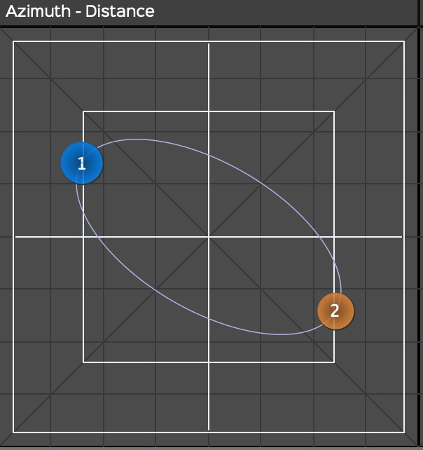Elliptical motion around the
centre.

Options: CW/CCW, Back &amp; Forth, Dampening, Deviation.
</td>
</tr>
<tr class="even">
<td><strong>3) Spiral</strong></td>
</tr>
<tr class="odd">
<td>
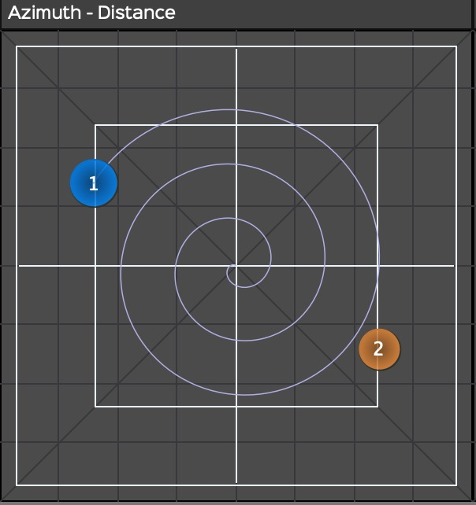Concentric motion around the
centre.

Options: CW/CCW, Back &amp; Forth, Dampening, Deviation.
</td>
</tr>
<tr class="even">
<td><strong>4) Square</strong></td>
</tr>
<tr class="odd">
<td>
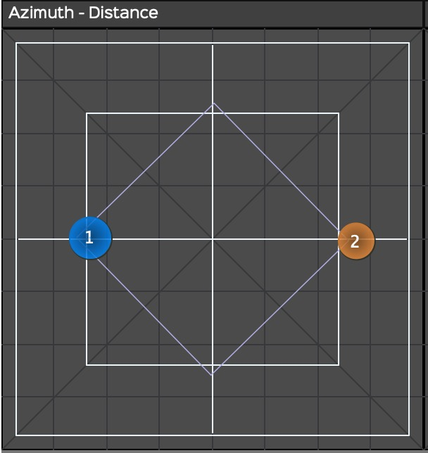Square shape around the centre.

Options: CW/CCW, Back &amp; Forth, Dampening, Deviation.
</td>
</tr>
<tr class="even">
<td><strong>5) Triangle</strong></td>
</tr>
<tr class="odd">
<td>
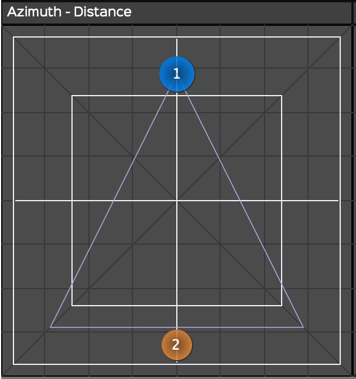Triangle shape around the
centre.

Options: CW/CCW, Back &amp; Forth, Dampening, Deviation.
</td>
</tr>
</tbody>
</table>

### 8.2.2. Elevation (CUBE mode only)

<table>
<colgroup>
<col style="width: 100%" />
</colgroup>
<thead>
<tr class="header">
<th><strong>1) Down Up</strong></th>
</tr>
</thead>
<tbody>
<tr class="odd">
<td>
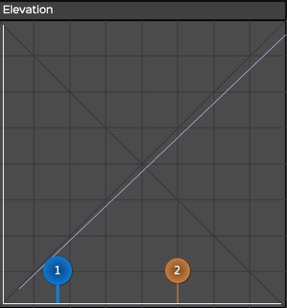From the bottom to the top.

Options: Back &amp; Forth, Dampening.
</td>
</tr>
<tr class="even">
<td><strong>2) Up Down</strong></td>
</tr>
<tr class="odd">
<td>
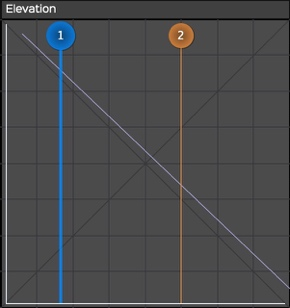 From the top to the bottom.

Options: Back &amp; Forth, Dampening
</td>
</tr>
</tbody>
</table>

## 8.3. OSC messages in SpatGRIS

OSC can be sent directly to *SpatGRIS* without having to use
*ControlGRIS*.

OSC Input port number: 18032 by default (can be changed in File -\>
Settings)

The server address is always /spat/serv.

**Please note that angles are always measured clockwise, starting from
the upstage centre (the positive Y direction).**

**pol** moves a source using polar coordinates in radians.

<table>
<colgroup>
<col style="width: 18%" />
<col style="width: 13%" />
<col style="width: 28%" />
<col style="width: 39%" />
</colgroup>
<thead>
<tr class="header">
<th><strong>#parameter</strong></th>
<th><strong>type</strong></th>
<th><strong>allowed values</strong></th>
<th><strong>meaning</strong></th>
</tr>
</thead>
<tbody>
<tr class="odd">
<td>1</td>
<td>string</td>
<td>pol</td>
<td>-</td>
</tr>
<tr class="even">
<td>2</td>
<td>int</td>
<td>[1, 256]</td>
<td>Source index</td>
</tr>
<tr class="odd">
<td>3</td>
<td>float</td>
<td>any</td>
<td>azimuth angle</td>
</tr>
<tr class="even">
<td>4</td>
<td>float</td>
<td>any</td>
<td>elevation angle</td>
</tr>
<tr class="odd">
<td>5</td>
<td>float</td>
<td>[-3.0, 3.0]</td>
<td>radius</td>
</tr>
<tr class="even">
<td>6</td>
<td>float</td>
<td>[0, 1]</td>
<td>Horizontal span</td>
</tr>
<tr class="odd">
<td>7</td>
<td>float</td>
<td>[0, 1]</td>
<td>Vertical span</td>
</tr>
</tbody>
</table>

ex : The message /spat/serv pol 7 0.0 0.78 0.5 0.1 0.2 moves the source
\#7 in the front at half elevation and placed at half the distance from
the origin, with an horizontal span of 10% and a vertical span of 20%.

**
**

**deg** moves a source using polar coordinates in degrees.

<table>
<colgroup>
<col style="width: 20%" />
<col style="width: 15%" />
<col style="width: 26%" />
<col style="width: 38%" />
</colgroup>
<thead>
<tr class="header">
<th><strong>index</strong></th>
<th><strong>type</strong></th>
<th><strong>allowed values</strong></th>
<th><strong>meaning</strong></th>
</tr>
</thead>
<tbody>
<tr class="odd">
<td>1</td>
<td>string</td>
<td>deg</td>
<td>-</td>
</tr>
<tr class="even">
<td>2</td>
<td>int</td>
<td>[1, 256]</td>
<td>Source index</td>
</tr>
<tr class="odd">
<td>3</td>
<td>float</td>
<td>any</td>
<td>azimuth angle</td>
</tr>
<tr class="even">
<td>4</td>
<td>float</td>
<td>any</td>
<td>elevation angle</td>
</tr>
<tr class="odd">
<td>5</td>
<td>float</td>
<td>[-3.0, 3.0]</td>
<td>radius</td>
</tr>
<tr class="even">
<td>6</td>
<td>float</td>
<td>[0, 1]</td>
<td>Horizontal span</td>
</tr>
<tr class="odd">
<td>7</td>
<td>float</td>
<td>[0, 1]</td>
<td>Vertical span</td>
</tr>
</tbody>
</table>

ex : The message /spat/serv deg 7 -90.0 45.0 0.5 0.1 0.2 moves the
source \#7 at the extreme left, at half elevation and half the distance
of the space, with an horizontal span of 10% and a vertical span of 20%.

**car** moves a source using Cartesian coordinates.

<table>
<colgroup>
<col style="width: 19%" />
<col style="width: 18%" />
<col style="width: 22%" />
<col style="width: 38%" />
</colgroup>
<thead>
<tr class="header">
<th><strong>index</strong></th>
<th><strong>type</strong></th>
<th><strong>allowed values</strong></th>
<th><strong>meaning</strong></th>
</tr>
</thead>
<tbody>
<tr class="odd">
<td>1</td>
<td>string</td>
<td>car</td>
<td>-</td>
</tr>
<tr class="even">
<td>2</td>
<td>int</td>
<td>[1, 256]</td>
<td>Source index</td>
</tr>
<tr class="odd">
<td>3</td>
<td>float</td>
<td>[-1.66, 1.66]</td>
<td>x (left/right)</td>
</tr>
<tr class="even">
<td>4</td>
<td>float</td>
<td>[-1.66, 1.66]</td>
<td>y (back/front)</td>
</tr>
<tr class="odd">
<td>5</td>
<td>float</td>
<td>[-1.66, 1.66]</td>
<td>z (down/up)</td>
</tr>
<tr class="even">
<td>6</td>
<td>float</td>
<td>[0, 1]</td>
<td>Horizontal span</td>
</tr>
<tr class="odd">
<td>7</td>
<td>float</td>
<td>[0, 1]</td>
<td>Vertical span</td>
</tr>
</tbody>
</table>

ex : The message /spat/serv car 7 1.0 1.0 1.0 0.0 0.0 moves the source
\#7 at the top right corner, with no horizontal or vertical spans.

**clr** clears a source's position.

<table>
<colgroup>
<col style="width: 22%" />
<col style="width: 17%" />
<col style="width: 20%" />
<col style="width: 39%" />
</colgroup>
<thead>
<tr class="header">
<th><strong>index</strong></th>
<th><strong>type</strong></th>
<th><strong>allowed values</strong></th>
<th><strong>meaning</strong></th>
</tr>
</thead>
<tbody>
<tr class="odd">
<td>1</td>
<td>string</td>
<td>clr</td>
<td>clear</td>
</tr>
<tr class="even">
<td>2</td>
<td>int</td>
<td>[1, 256]</td>
<td>Source index</td>
</tr>
</tbody>
</table>

ex : The message /spat/serv clr 7 clears the seventh source's position.

**alg** sets a source's hybrid spatialization mode.

<table>
<colgroup>
<col style="width: 25%" />
<col style="width: 15%" />
<col style="width: 20%" />
<col style="width: 38%" />
</colgroup>
<thead>
<tr class="header">
<th><strong>index</strong></th>
<th><strong>type</strong></th>
<th><strong>allowed values</strong></th>
<th><strong>meaning</strong></th>
</tr>
</thead>
<tbody>
<tr class="odd">
<td>1</td>
<td>string</td>
<td>alg</td>
<td>-</td>
</tr>
<tr class="even">
<td>2</td>
<td>int</td>
<td>[1, 256]</td>
<td>Source index</td>
</tr>
<tr class="odd">
<td>3</td>
<td>string</td>
<td>dome or cube</td>
<td>Algorithm</td>
</tr>
</tbody>
</table>

ex : The message /spat/serv alg 7 cube sets the seventh source's
spatialization algorithm to "cube" (only works in *hybrid* mode).

## 8.4. OSC messages in ControlGRIS

There are the OSC messages that *ControlGRIS* can send and receive. The
first number corresponds to the plugin ID. The second number corresponds
to the source number. These are the default values:

• /controlgris/1/traj/1/x value =\> \[0.0;1.0\]

• /controlgris/1/traj/1/y value =\> \[0.0;1.0\]

• /controlgris/1/traj/1/z value =\> \[0.0;1.0\]

• /controlgris/1/traj/1/xyz/1 value =\> \[0.0;1.0\]

• /controlgris/1/traj/1/xyz/2 value =\> \[0.0;1.0\]

• /controlgris/1/traj/1/xyz/3 value =\> \[0.0;1.0\]

• /controlgris/1/traj/1/xy values =\> \[0.0;1.0\] \[0.0;1.0\]

• /controlgris/1/traj/1/xyz values =\> \[0.0;1.0\] \[0.0;1.0\]
\[0.0;1.0\]

• /controlgris/1/azispan value =\> \[0.0;1.0\]

• /controlgris/1/elespan value =\> \[0.0;1.0\]

• /controlgris/1/sourcelink value =\> 1 to 8

1: Independent

2: Circular

3: Circular Fixed Radius

4: Circular Fixed angle

5: Circular Fully Fixed

6: Delta Lock

7: Symmetrix X

8: Symmetric Y

• /controlgris/1/sourcelinkalt value =\> 1 to 5

1: Independent

2: Equal Elevation

3: Bottom-Top

4: Top-Bottom

5: Delta Lock

• /controlgris/1/presets value =\> 1 to 50

• /controlgris/1/elevationmode value =\> 1 to 3

1: Normal

2: Extended Top

3: Extended Top and Bottom

## 8.5. Open Stage Control and Lemur

Two external controllers are available for *ControlGRIS*:

• An Open Stage Control patch for iPad™.

• A Lemur patch for iPad™.

An Addendum manual concerning these patches is available on SourceForge.

## 8.6. Uninstall

### 8.6.1. SpatGRIS

If you need to uninstall *SpatGRIS*, or if you find some strange
behaviour of the software, you'll have to do so manually.

• Put the application itself in the trash.

• Put these files to the trash:

~/Library/Preferences/ca.umontreal.musique.gris.spatgris.plist

~/Application Support/GRIS/ SpatGRIS.x.x.xml where x.x.x is the version
of *SpatGRIS* (3.2.1 for instance).

### 8.6.2. ControlGRIS

If you need to uninstall *ControlGRIS*.

Here are the paths for Mac users:

• To uninstall the Audio Unit version, delete it from the following
location: ~/Library/Audio/Plug-Ins/Components

• To uninstall the VST version, delete it from the VST folder to the
following location: ~/Library/Audio/Plug-Ins/VST

• To uninstall the VST3 version, delete it from the VST3 folder to the
following location: ~/Library/Audio/Plug-Ins/VST3.

• To uninstall the AAX version, delete it from the following location:
MacIntosh HD/Library/Application Support/Avid/Audio/Plug-Ins/
