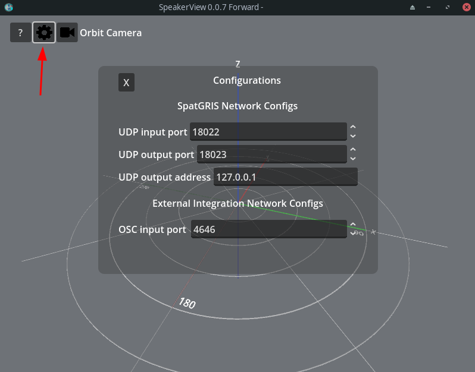
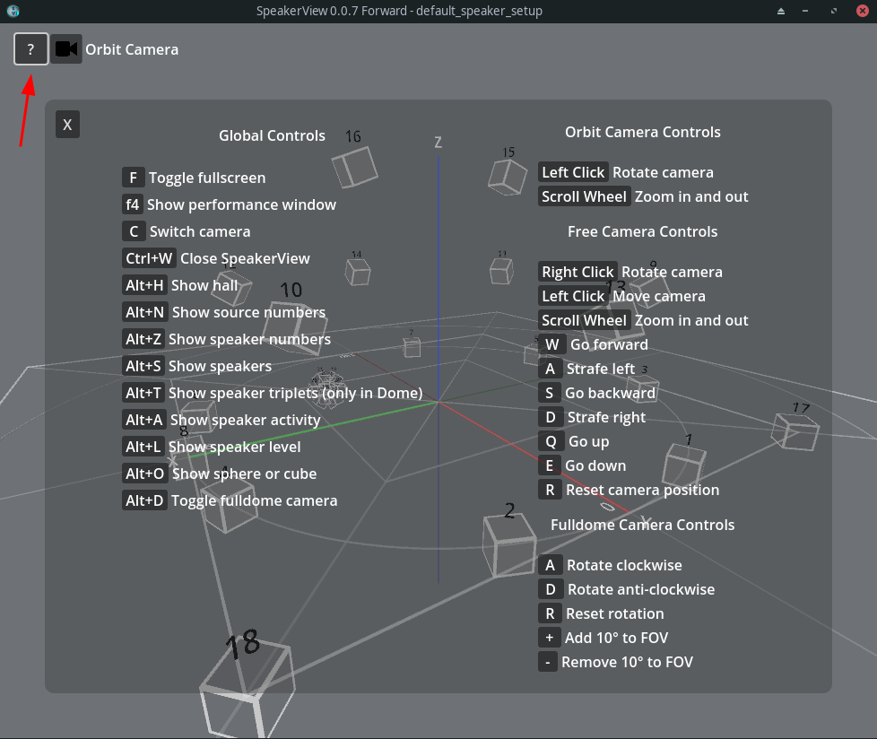
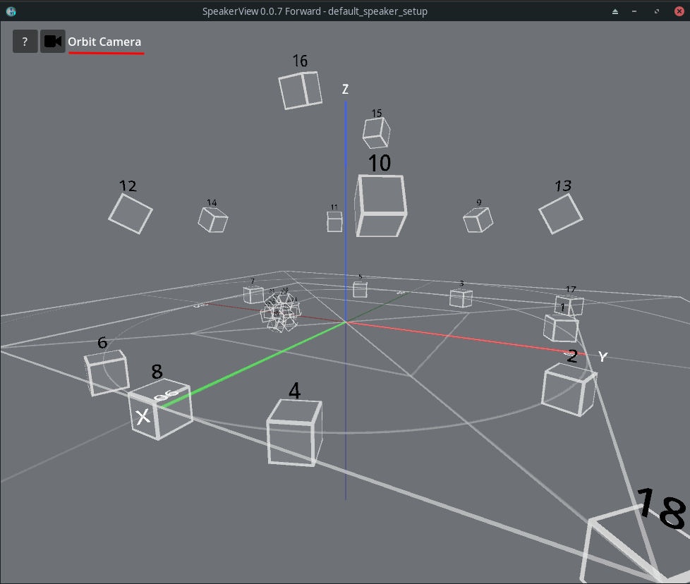
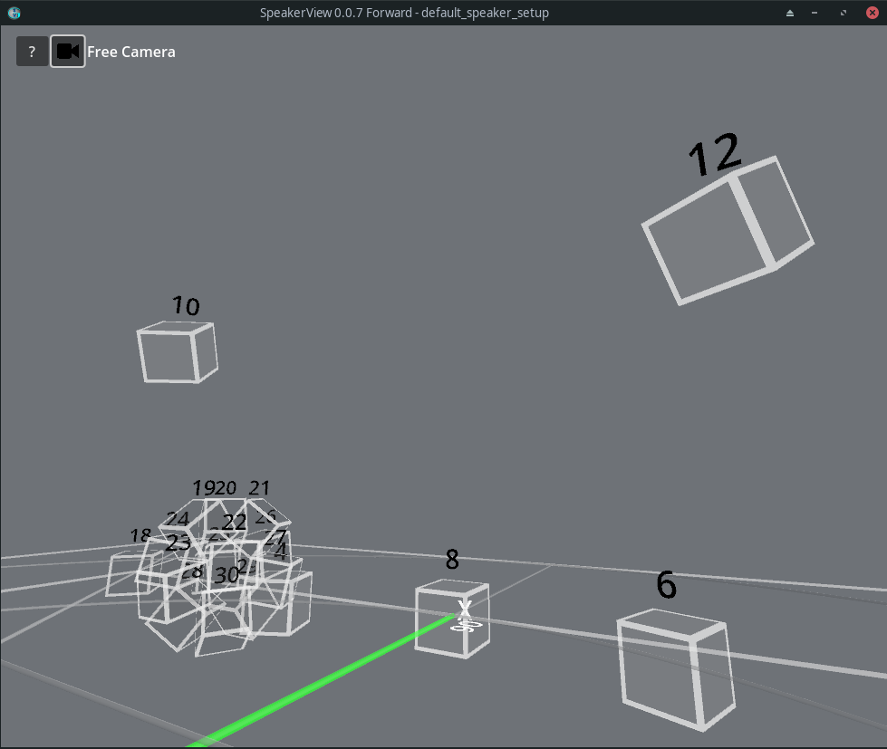
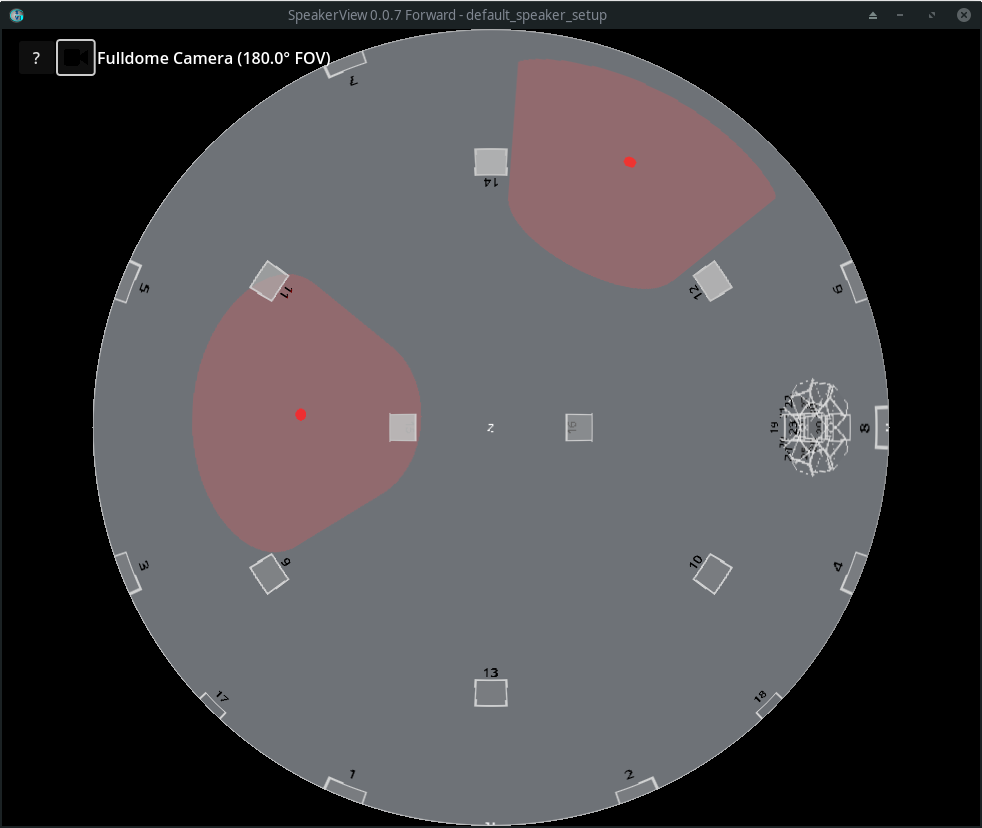

# SpeakerView

**SpeakerView** is an application that provides a three-dimentional visualization of the speaker setup for the GRIS suite.

It functions as a visual monitoring tool for designing complex spatial audio environments; It allows the user to visually confirm that the virtual speaker setup in the software accurately reflects the physical placement of speakers in the space.

It also serves as a visualiser for the position and activity of audio sources.

## Modes of operation

### Usage with SpatGRIS

For most common workflows, SpeakerView will be used with SpatGRIS on the same computer. It will automatically be launched when the main SpatGRIS application is launched.

### Standalone

It is possible to run SpeakerView as a standalone, independent application. It will be ready to receive data over the network. This way the user can monitor a SpatGRIS session running on a different machine on the network.

When running SpeakerView in standalone mode, an additional settings menu will be displayed. You can change the following network settings using it:

- **UDP input and output ports**: For SpatGRIS network communication. 18022 and 18023 by default, respectively
- **UDP output address**: Target address for outgoing messages to your SpatGRIS instance. 127.0.0.1 (localhost) by default.
- **OSC input port** : The port where SpeakerView listens for incoming OSC messages. 4646 by default.

In addition to SpatGRIS's UDP messages, SpeakerView accepts the following OSC message format/pattern:

- /**control**/show\_source\_numbers
- /control/show\_speaker\_numbers
- /control/spat\_mode
- /**source**/{id}/color
- /source/{id}/position
- /**speaker**/{id}/position
- ….

It is thus possible to use SpeakerView as a visualizer for other spatialization systems.

## Controls

SpeakerView has a menu that exposes all the essential keyboard shortcuts directly in the viewport, making the tool intuitive and easy to navigate.

## Cameras

SpeakerView includes multiple camera modes to allow you to visualize the area you are interested in.

Note that camera positions are independent and are saved and restored when you go from one camera to another.

The camera button switches between the orbit camera and the free view camera. The dome camera was judged to be less generally useful and can be accessed with a keyboard shortcut.

### Orbit camera

This is the default camera that is loaded when launching the application. In this view, the user can rotate around the center of the scene and zoom in and out.

### Free camera

This mode allows the user to roam around the virtual space using a first-person point of view (W, A, S, D keys for movement, as standard controls). This mode offers the ability to move to a specific listener’s position

### Fulldome camera

If you have access to a dôme that includes video projection, you can use the fulldome camera so that SpeakerView displays the space as a [dome master](https://imersa.org/images/standards/Dome_Master_Specifications_2019.pdf) format. This way, you'll be able to visualize the speakers and sources directly in the diffusion space.

You can adjust the FOV (field of view) of the camera with the + and - keys to match the projection surface of your dome. You can also rotate the view with the a and d keys to make fine adjustments.

