# 10. Conseil et astuces

Outre l'usage normal de SpatGRIS qui permet de programmer la
spatialisation sonore de sources diverses et variées, voici quelques
exemples d'usages différents, qui ne viennent pas à l'esprit dans un
premier temps. C'est avec les années que ces usages sont apparus à
travers les pratiques inventives de nos utilisateurs.

## 10.1. Spatialisation acousmatique

Il est tout à fait possible d'utiliser SpatGRIS dans le cadre d'une
spatialisation acousmatique traditionnelle, où une source stéréophonique
est multipliée sur autant de paires d'enceintes dans la salle de
concert. Nous l'avons utilisé de cette manière pendant des années lors
des concerts hebdomadaires du cours d'Histoire de la musique électro.

### 10.1.1. Console de mixage

Pour arriver à faire de la spatialisation dans un contexte acousmatique,
il faut disposer d'une console de mixage avec transmission Ethernet
(idéale, comme une AVID S1 ou une Euphonix) ou MIDI (plus lente, comme
une Mackie Control ou une Behringer).

### 10.1.2. Station Audio Numérique

Dans le SAN de votre choix (DP, Logic, Live, Nuendo, Reaper, etc.), vous
placez le fichier audio stéréo sur la première piste stéréo sur laquelle
vous placez également un plugiciel ControlGRIS2. Ensuite, vous
multipliez des copies de cette première piste stéréo sur autant
d'exemplaires supplémentaires que comporte votre scénario de
spatialisation. Il est également possible de n'avoir qu'une seule piste
audio et autant de sorties auxiliaires que nécessaires, si votre SAN le
permet. Chaque piste et chaque instance de ControlGRIS2 seront assignées
à des numéros consécutifs. Il est important de mentionner ici que l'on
n'est pas dans une logique de correspondance un potentiomètre = un
haut-parleur. Chaque haut-parleur peut servir à plusieurs scénarios de
spatialisation.

### 10.1.3. Dispositif acousmatique

Utilisons le dispositif suivant Dome24(8-5x2-6)Subs2 Acousmonium présent
dans les Templates de SpatGRIS. Celui-ci est constitué de:

• 1 octophonie, de 1 à 8

• 1 paire asymétrique à gauche 9-10 (sorties directes)

• 1 paire solo centrale 11-12 (sorties directes)

• 1 paire stéréo principale 13-14 (sorties directes)

• 1 paire asymétrique à centre droit 15-16(sorties directes)

• 1 paire asymétrique à gauche 17-18(sorties directes)

• 1 groupe hexaphonique 19 à 24

• 1 paire de subwoofers 25-26 (sorties directes)

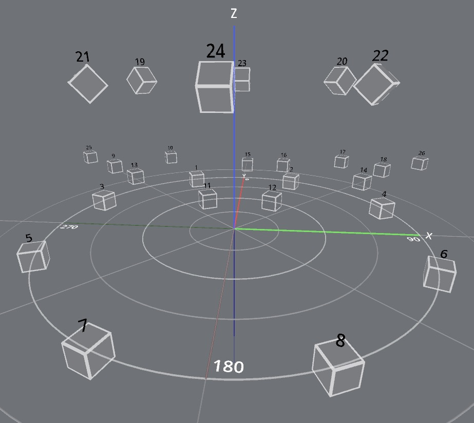

### 10.1.4. Scénario

Le premier scénario consisterait à assigner à chaque potentiomètre un
groupe de haut-parleurs dans l'ordre mentionné ci-haut. Cela nécessite 8
potentiomètres, puisqu’il y a 8 groupes de haut-parleurs. Les sorties
directes n'ont pas besoin de ControlGRIS2.

• Potentiomètre 1: ControlGRIS2 1-2, BlackHole sorties audio 1-2,
Position gauche-droite, Azimuth Span à 50%.

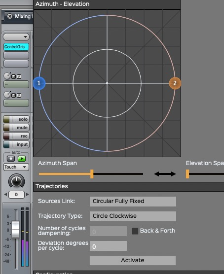

Ainsi, la source stéréo est entièrement répartie sur les 8 hp du groupe
octophonique.

Le canal gauche sur les hp impairs (en turquoise pâle) et le canal droit
sur les hp pairs (en turquoise plus foncé):

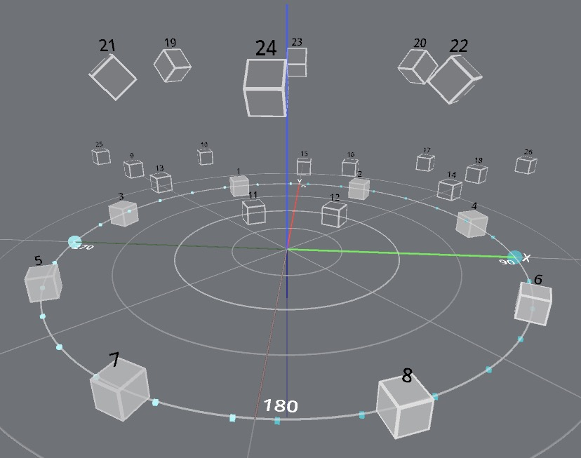

• Potentiomètre 2: pas de ControlGRIS2, BlackHole sorties 3-4, H-P 9-10
sorties directes dans SpatGRIS (en noir):

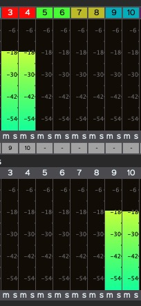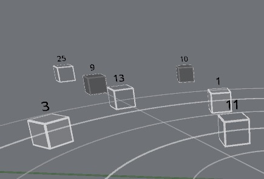

• Potentiomètre 3: pas de ControlGRIS2, BlackHole sorties 5-6, H-P 11-12
sorties directes dans SpatGRIS (en noir):

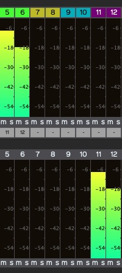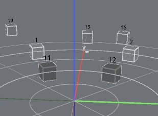

• Potentiomètre 4: pas de ControlGRIS2, BlackHole sorties 7-8, H-P 13-14
sorties directes dans SpatGRIS (en noir):

Même scénario

• Potentiomètre 5: pas de ControlGRIS2, BlackHole sorties 9-10, H-P
15-16 sorties directes dans SpatGRIS (en noir):

Même scénario

• Potentiomètre 6: pas de ControlGRIS2, BlackHole sorties 11-12, H-P
17-18 sorties directes dans SpatGRIS (en noir):

Même scénario

• Potentiomètre 7: ControlGRIS2 13-14, BlackHole sorties 13-14, H-P
19-24 Position gauche-droite, Azimuth Span à 50%, Élévation dans le haut
du dôme:

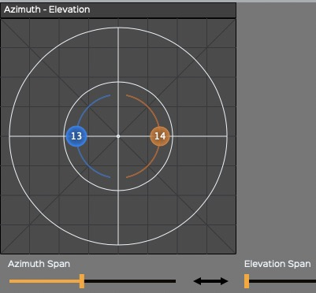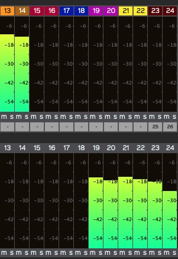

Le canal gauche sur les hp impairs (en orange pâle) et le canal droit
sur les hp pairs (en orange plus foncé):

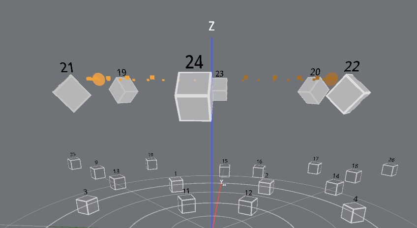

## 10.2. Utilisation du PLAYER en votre absence

Le PLAYER (voir le chapitre 6. PLAYER) est un outil très puissant dans
*SpatGRIS* qui permet d'enregistrer un projet dans le dispositif
originel et ensuite de le jouer dans un autre dispositif, celui d'une
salle de concert par exemple. La situation typique est celle où une de
vos œuvres est jouée ailleurs en votre absence. Vous pouvez alors
enregistrer votre projet grâce à la fonction Record (voir le chapitre
5.11. Enregistrement) en cochant la case Export Speaker Setup:

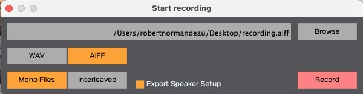

Les fichiers audios et le dispositif de haut-parleurs originel seront
sauvegardés dans le même dossier. Vous pouvez faire parvenir celui-ci à
votre destinataire qui pourrait jouer votre pièce dans son propre
dispositif. Cette fonction est très utile pour contribuer à la diffusion
des musiques multicanales.

## 10.3. Le mode HYBRID pour varier les trajectoires

Le mode HYBRID (voir le chapitre 5.7. Le mode HYBRID) est en réalité un
DOME dans lequel il est possible de déplacer des sources en mode CUBE.
En mode DOME exclusif, les sources sont obligatoirement placées sur la
surface du dôme. C'est l'algorithme VBAP qui impose cela. Il n'est donc
pas possible de placer un son à l'intérieur du dôme ou à l'extérieur de
celui-ci. En adoptant le mode HYBRID, les sources peuvent soit se
comporter en mode DOME, soit en mode CUBE:

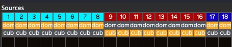

Comme on peut le voir ici, certaines sources (en bourgogne) sont situées
à l'extérieur du dôme alors que d'autre (en bleu clair) sont à
l'intérieur de celui-ci.

Le mode HYBRID permet ainsi de varier les trajectoires en mode DOME:

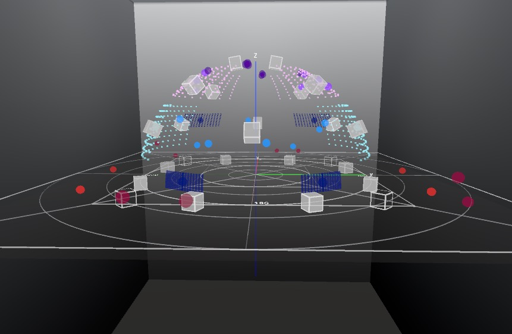
