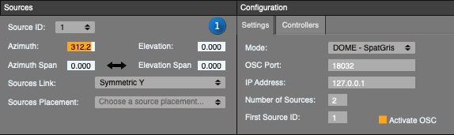
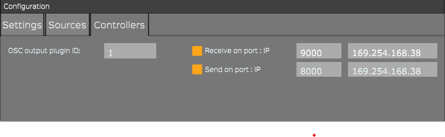
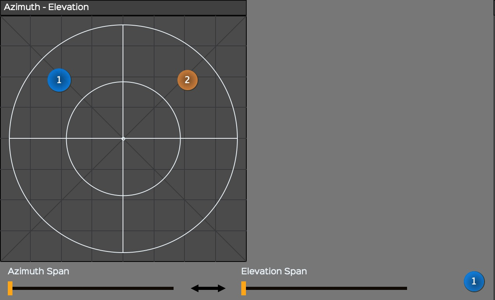
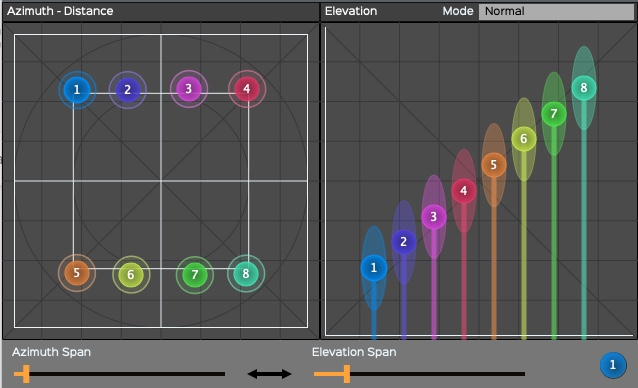
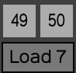
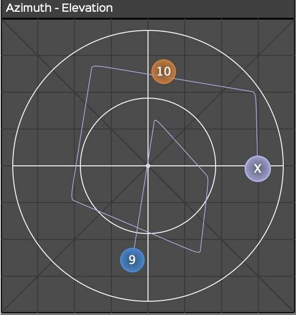
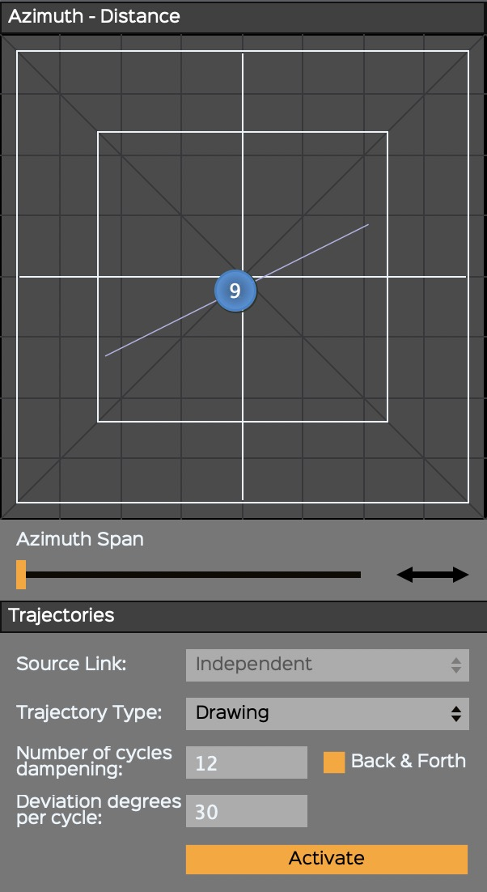

# 4. ControlGRIS2

*ControlGRIS2* est un plugiciel OSC qui offre deux possibilités, selon
le mode choisi dans *SpatGRIS*:

• DOME.

• CUBE.

Ces deux modes seront expliqués en détail dans la section *SpatGRIS*.

## 4.1. Introduction

*ControlGRIS2* est un plugiciel de spatialisation OSC. Ce plugiciel
permet de déplacer des sources sonores multicanaux sur un ensemble
variable de haut-parleurs. Plusieurs modes de liaison des sources et un
système de trajectoires sont fournis pour permettre la spatialisation de
sources mono, stéréo, quad, 5.1 ou multicanaux jusqu'à huit canaux.
*ControlGRIS2* ne gère pas l'audio, il ne gère que les données qui sont
envoyées à *SpatGRIS*. L'audio lui-même est envoyé du SAN directement à
*SpatGRIS* via *BlackHole*.

Ce document décrit les instructions d'utilisation et les fonctions
spécifiques à *ControlGRIS2*. Il est supposé que l'utilisateur.trice ait
une connaissance suffisante du logiciel hôte et qu'iel peut exécuter les
fonctions de base pour le configurer.

## 4.2. Interface graphique

L'interface graphique permet de placer les sources sonores. Elle est
légèrement différente en mode DOME qu'en mode CUBE. Dans DOME, la
distance étant fixée à 1.00, il n'y a que les paramètres Azimuth et
Elevation à régler. En CUBE, les trois paramètres, X, Y et Z sont
réglables sur deux fenêtres différentes.

## 4.3. Panneau de configuration

Le panneau de configuration donne accès aux différents paramètres du
plugiciel. Ces paramètres sont regroupés sous trois onglets : Sources,
Settings, et Controllers.

### 4.3.1. Settings

#### MODE

Le mode DOME est basé sur l'algorithme VBAP conçu par Ville Pulkki. Dans
ce mode, l'espace est représenté par un dôme où la distance entre chaque
point de la surface et le centre du dôme est égale à 1,00. Le mode CUBE
est basé sur l'algorithme original MBAP[^lbap-footnote] conçu par Gaël Lane Lépine.
Dans ce mode, l'espace est représenté par un cube à l'intérieur duquel
il est possible de concevoir n'importe quelle configuration de
haut-parleurs.

#### OSC Port

Il s'agit du numéro de port OSC pour la communication entre
*ControlGRIS2* et *SpatGRIS*. Ils doivent être réglés sur le même. 18032
est la valeur par défaut.

#### IP Address

La valeur par défaut est 127.0.0.1, ce qui correspond à l'adresse du
dispositif interne (c'est-à-dire votre ordinateur). Cette valeur peut
être modifiée pour envoyer l'OSC à un ordinateur externe.

#### Nombre des sources

Le nombre de sources par piste correspond au nombre de canaux audio de
la piste. Ce nombre est limité à huit canaux (comme dans la plupart des
SAN).

#### First Source ID

Ce numéro doit être unique et différent pour chaque canal audio. Vous
devez utiliser les mêmes numéros pour l'audio et pour l'OSC.

Si vous n'avez que des pistes mono, les numéros sont successifs. Si vous
avez des pistes stéréo, vous n'aurez que des numéros impairs à placer
ici : 1, 3, 5, etc., car les numéros pairs sont automatiquement
attribués au canal droit de chaque piste stéréo. Et si vous travaillez
avec des fichiers sonores octophoniques, le premier identifiant de
source sera 1, la deuxième piste octophonique commencera à 9, etc.

### 4.3.2. Sources

Sous l'onglet Sources, il est possible de positionner précisément les
sources en utilisant l'interface graphique ou les zones de texte. Grâce
à l'option Sources Placement, il est possible de positionner les sources
à équidistance, dans le sens des aiguilles d'une montre ou dans un ordre
alternatif. Pour ce faire, il suffit de sélectionner la répartition
souhaitée dans le menu déroulant.

De plus, il est possible d'ajuster manuellement la position de chaque
source en entrant ses coordonnées polaires (DOME) ou cartésiennes
(CUBE). Dans le menu déroulant Source Number, sélectionnez d'abord le
numéro de la source à déplacer. Ensuite, entrez ses nouvelles
coordonnées.

Dans DOME, Elevation et Azimuth correspondent aux coordonnées polaires
courantes de la source sélectionnée :

Dans CUBE, X, Y et Z correspondent aux coordonnées cartésiennes
courantes de la source sélectionnée :

NOTE : Le positionnement manuel des sources individuelles ne fonctionne
que lorsque le mode Independent est sélectionné dans le menu Sources
Link.

### 4.3.3. Contrôleurs

*ControlGRIS2* peut être manipulé par un contrôleur Open Sound
Control[^osc-footnote] (OSC) externe. Il existe une interface réalisée pour Open
Stage Control et une autre pour Lemur qui permettent de manipuler les
paramètres de *ControlGRIS2* depuis un *iPad*[^ipad-footnote].

• OSC output plugin ID : pour contrôler différentes instances de
*ControlGRIS2*, chacune doit avoir un ID différent.

• Receive et Send doivent être réglés en fonction des canaux OSC
appropriés (par défaut : 9000 et 8000).

• Les adresses de port IP doivent être définies en fonction de votre
réseau Wi-Fi, qu'il soit public ou local. L'ordinateur et le contrôleur
doivent être sur le même réseau. *ControlGRIS2* reçoit automatiquement
l'adresse d'entrée de votre réseau.

## 4.4. Vues de la spatialisation

*ControlGRIS2* fonctionne en deux modes différents pour la
spatialisation du son : DOME et CUBE.

### 4.4.1 Vue en mode DOME

En mode DOME, l'interface graphique est limitée à Azimuth-Elevation.
Dans ce mode, le son est spatialisé sur la surface du dôme. Alors qu'une
source placée au centre se trouve en haut du dôme, une source placée à
la périphérie se trouve en bas du dôme.

Le dôme est représenté ici de haut en bas, avec des exemples d'une
source stéréo à gauche et d'une source octophonique à droite :

### 4.4.2. Spans en mode DOME

Dans les deux modes, les paramètres de Span sont disponibles pour
l'azimut et l'élévation. Le Span permet d'étendre le signal à une zone
plus large que la source elle-même. En mode DOME, les Spans ressemblent
à un arc de cercle de chaque côté de la source :

### 4.4.3. Vue en mode CUBE

En mode CUBE, l'interface graphique est divisée en deux écrans :
Azimuth-Distance et Elevation. Le mode CUBE ajoute la distance et permet
de déplacer un son à l'intérieur ou à l'extérieur de la configuration
des haut-parleurs (représentée par le carré blanc interne). Le CUBE est
représenté du haut à gauche et de profil à droite (la vue 3D n'apparaît
que dans *SpatGRIS*). Exemples de sources stéréo et octophonique :

### 4.4.4. Spans en mode CUBE

En mode CUBE, les Spans ressemblent à un cylindre entourant la source :

Dans certaines configurations CUBE, où la plupart des enceintes sont
réparties sur les murs et le plafond, une source peut être perdue au
centre de la salle. Si vous souhaitez créer un disque sonore plat qui
n'active que les enceintes situées à la même hauteur que la source, vous
pouvez ajouter un peu d'Azimuth Span :

### 4.4.5. Élévation en mode CUBE en mode Normal ou Extended Top

Depuis la version 1.4.1, *ControlGRIS2* offre la possibilité de placer
une source en dehors du CUBE en élévation. Cela était déjà possible sur
les axes x et y, et c'est maintenant possible sur l'axe z également.
Lors de l'utilisation du mode Extended Top, une ligne horizontale
blanche apparaît dans l'affichage de l'élévation. Cette ligne représente
la valeur 1,0 utilisée dans le mode Normal. C'est à partir de ce point
que les paramètres d'atténuation de *SpatGRIS* commencent à prendre
effet en élévation. Les sources seront filtrées en volume et/ou en
fréquences à mesure qu'elles s'éloignent du sommet du CUBE :

### 4.4.6. Élévation en mode CUBE dans les modes Extended Top et Bottom

Une deuxième ligne apparaît en mode Extended Top et Bottom pour atténuer
les sons envoyés sous le plancher (pour les chanceux qui ont accès à un
cube complet !) La ligne du haut représente la valeur 1.0 du mode
normal. La ligne du bas représente la valeur 0.0 du mode normal :

NOTE 1 : Les anciens projets peuvent toujours être utilisés en mode
Normal où la gamme complète de 0.00 à 1.00 est toujours disponible.

NOTE 2 : Il n'est pas encore possible de descendre sous le sol dans une
sphère complète avec *ControlGRIS2* en mode DOME. Nous y travaillons.
Mais il est possible de le faire en utilisant n'importe quel logiciel
qui envoie des données OSC directement à *SpatGRIS*.

## 4.5. Comment utiliser ControlGRIS2

*ControlGRIS2* est un plugiciel qui peut être inséré sur n'importe
quelle piste nécessitant une spatialisation. *ControlGRIS2* comprend un
système de trajectoire qui peut écrire des mouvements prédéfinis
rapidement et efficacement. La fonction d'automation du logiciel hôte
permet d'enregistrer et de reproduire les mouvements des sources. Il est
donc essentiel de comprendre les différents modes d'automation de votre
logiciel hôte préféré.

### 4.5.1. Charger le plugiciel sur une piste

*ControlGRIS2* se charge de la même manière que n'importe quel autre
plugiciel AU ou VST. Le plus souvent, *ControlGRIS2* est chargé à la fin
de la chaîne des effets de la piste.

NOTE : Dans chaque piste du SAN, il est obligatoire que les numéros des
canaux de sortie audio correspondent aux numéros des sources OSC
(définis par le paramètre First Source ID) dans l'instance de
*ControlGRIS2* correspondante pour que le son soit spatialisé dans
*SpatGRIS*. Si ce n'est pas le cas, la spatialisation sera silencieuse
ou ne fonctionnera pas correctement.

### 4.5.2. Sauvegarde des mémoires et enregistrement des automations

Il est possible de sauvegarder certains des paramètres du plugiciel
*ControlGRIS2* dans les 50 plages de mémoire fournies. Les raccourcis
sont les suivants :

• Shift-Click Numéro de mémoire : Save.

• Click Numéro de mémoire : Load.

• Opt[^opt-alt-footnote]-Click Numéro de mémoire : Delete.

Ces fonctions apparaissent sous la ligne 49-50 :

Ces mémoires vous permettent d'enregistrer et de rappeler les paramètres
suivants uniquement :

• Source positions (Azimuth-Distance-Elevation). Ceux-ci peuvent
également être automatisés.

Les paramètres qui ne sont pas enregistrés, mais qui peuvent être
automatisés :

• Spans.

• Sources Link et Sources Link Alt.

• Presets.

• Bypass.

Les paramètres qui ne sont pas sauvegardés et non automatisés, car ils
sont utilisés pour générer automatiquement une trajectoire qui sera
écrite par la SAN lui-même :

• Spans link.

• Trajectory Type.

• Dur per cycle.

• Sec(s)/Beat(s).

• Number of cycles dampening.

• Deviation degrees per cycle.

• Back & Forth.

• Activate.

Configuration tab

• L'ensemble de l'onglet Configuration n'est pas sauvegardé dans la
mémoire (celui-ci est sauvegardé avec le projet SAN). Ce n'est pas une
bonne idée de modifier ces paramètres à l'intérieur d'une piste.

REMARQUE : Bien qu'il soit possible d'enregistrer la position de toutes
les sources dans les préréglages, il n'est possible d'enregistrer que
l'automation de la source n° 1 dans le séquenceur. La source n° 1 est le
leader tandis que les autres sources sont des suiveurs.

### 4.5.3. Rappeler les mémoires

Comme indiqué ci-dessus, les mémoires ne mémorisent que la position des
sources. Lorsqu'une mémoire est chargée, les sources sont positionnées
en fonction des données stockées. Gardez cependant à l'esprit que le
séquenceur possède également une mémoire de la position précédente des
sources, et que les deux peuvent interagir de manière étrange. Très
souvent, ce n'est que lorsque vous démarrez le séquenceur que les
sources prennent leur position réelle. Pour éviter toute ambiguïté, la
sélection des mémoires peut être automatisée.

## 4.6. Trajectoires abstraites

Il est possible d'automatiser le déplacement des sources sonores à
l'aide de trajectoires prédéfinies. Dans le panneau de contrôle
Trajectories, vous pouvez définir et ajuster ces mouvements au contexte
musical. Le concept derrière les trajectoires est qu'il y a une source
leader tandis que les autres sont des suiveurs. Seule la source n° 1
peut être le leader.

Si vous essayez d'enregistrer l'automation d'une autre source que la
source n° 1, vous obtiendrez cet avertissement :

### 4.6.1. Sources Link

Le mode Independent n'est disponible que pour placer initialement les
sources de manière indépendante dans une piste multicanal. Mais la
position des sources ne peut pas être automatisée indépendamment. Seule
l'automatisation de la source no. 1 peut être enregistrée. Par
conséquent, une fois les sources placées, il est nécessaire de choisir
une autre Sources Link avant d'enregistrer l'automation.

#### Azimuth-Elevation (DOME) et Azimuth-Distance (CUBE) Links

Dans la section Trajectories, sous le menu déroulant Sources Link, il
est possible de choisir différentes façons de relier les sources entre
elles. En fonction du nombre de canaux, certains liens peuvent ne pas
être disponibles :

• Mono: seulement Independent.

• Stereo: tous les liens

• Multichannel: tous sauf Symmetric X et Y.

• Des représentations détaillées des liens Azimuth-Elevation et
Azimuth-Distance sont présentées dans l'Addendum 8.1.1.

#### Elevation Links (CUBE mode seulement)

En mode CUBE, les Elevation Links entre les sources sont indépendants
des paramètres d'azimut et de distance.

• Des représentations détaillées des Elevation Links sont présentées
dans l'Addendum 8.1.2.

### 4.6.2. Types de trajectoires

Automatiser le déplacement d'une source est très simple grâce aux
différents types de trajectoires disponibles.

• Des représentations détaillées des Trajectories sont présentées dans
l’Addendum 8.2.

#### Azimuth-Elevation (DOME) et Azimuth-Distance (CUBE) Trajectory Type

Un menu déroulant vous permet de sélectionner différents types de
trajectoires tels que le cercle, l'ellipse, la spirale, le carré et le
triangle, dans le sens des aiguilles d'une montre ou dans le sens
inverse.

#### Elevation (CUBE seulement) Trajectory Type

Un menu déroulant avec différents types de trajectoires vous permet de
choisir parmi une variété de trajectoires telles que Haut-Bas, Bas-Haut.

Autres paramètres

• La durée de la trajectoire en seconde(s) ou en mesure(s) (beats) (liée
au tempo MIDI du séquenceur hôte).

• Le nombre de cycles d'amortissement (Number of cycles dampening): la
durée totale = Durée par cycle x Nombre de cycles x 1,5. Le Dampening ne
fonctionne qu'avec le Back & Forth.

• L’option Back & Forth (aller-retour).

• La déviation en degrés par cycle (The Deviation degrees per cycle.)

#### Realtime

Il s'agit de l'enregistrement habituel des automations : vous déplacez
un paramètre (ou plusieurs paramètres) et cela est enregistré dans la
SAN.

#### Drawing

Le mode Drawing vous permet de dessiner une trajectoire directement dans
le plugiciel lui-même. Cette trajectoire peut ensuite être modifiée en
éditant la durée, l'amortissement et la déviation. Lorsque les
paramètres souhaités sont trouvés, ils peuvent être enregistrés dans la
station de travail audio elle-même.

Le mode Drawing est un mode à main levée. Lorsque vous le sélectionnez,
une croix gris pâle apparaît, avec laquelle vous dessinez une
trajectoire. La durée de la trajectoire et le dessin sont temporairement
stockés dans le plugiciel. Dans Azimuth-Elevation (DOME) ou
Azimuth-Distance (CUBE), c'est la position qui est enregistrée. En
élévation (CUBE uniquement), c'est la position dans le temps qui est
enregistrée. Les deux fenêtres partagent un cycle qui peut être modifié
à l'aide des paramètres habituels. Pour voir la trajectoire en action,
vous pouvez activer les boutons Activate et jouer la séquence. Lorsque
le séquenceur s'arrête, les boutons d'activation redeviennent éteints.
Des modifications peuvent être apportées, puis il est possible d'activer
à nouveau Activate. Une fois satisfait du résultat, il est possible
d'enregistrer la trajectoire dans la SAN.

#### Maj-Clic en mode Drawing

En appuyant sur la touche Maj en mode Drawing, il est possible de
dessiner des lignes droites ou des figures géométriques irrégulières
dans la fenêtre Azimuth-Elevation (DOME) ou Azimuth-Distance (CUBE).
Chaque fois que vous cliquez, un nouvel angle est créé. N'oubliez pas de
cliquer une dernière fois lorsque vous avez terminé !

NOTE: Attention à la trajectoire à main levée, car elle est temporaire.
Si vous cliquez n'importe où dans la fenêtre après avoir dessiné une
trajectoire, ou si vous fermez le plugiciel ou la session, elle sera
automatiquement effacée. Un seul geste peut être enregistré
temporairement à la fois. La croix X pourrait être cachée derrière l'une
des sources. Il suffit de déplacer l'une d'entre elles pour la
retrouver.

#### Activate

En appuyant sur le bouton Activate, *ControlGRIS2* attend le démarrage
du séquenceur. Lorsque la séquence est lancée, le plugiciel démarre la
trajectoire selon les paramètres spécifiés. Le mouvement produit peut
être enregistré — coordonnées X, Y et Z de la source n° 1 — comme toute
autre automatisation. Lorsque le séquenceur s'arrête, les boutons
d'activation reviennent à l'état OFF. Il est important de placer la tête
de lecture dans la bonne position avant d'appuyer sur le bouton Activate
et de lancer la séquence.

#### Enregistrement de la trajectoire dans la SAN

Comme expliqué ci-dessus, *ControlGRIS2* attend que le séquenceur hôte
démarre avant de commencer une trajectoire. Les pistes qui contiennent
*ControlGRIS2* peuvent être configurées en mode d'écriture (Touch, Latch
ou Write — selon les options de votre SAN) pour enregistrer les
mouvements des sources comme automations. Ces automations sont alors
disponibles pour la lecture et l'édition.

NOTE: Seule la source n°1 (leader) est enregistrée, les autres sources
étant des suiveurs. Il est toujours préférable d'enregistrer les
automations de trajectoires dans la SAN après avoir trouvé les bons
réglages, car cela libère le CPU utilisé par *ControlGRIS2*.

### 4.6.3. Un cas particulier : le pendule

Une utilisation spécifique du Shift-Click en mode Drawing peut être
utilisée pour concevoir un pendule. Si une simple ligne est tracée avec
Shift-Click, elle constitue l'élément de base d'un pendule. Ensuite, les
fonctions Dur per cycle, Dampening, Deviation et Back & Forth peuvent
être utilisées pour rendre ce pendule très intéressant. Il peut être
placé n'importe où dans l'espace.

### 4.6.4. Mémoires et trajectoires automatisées

Il est possible d'enregistrer la sélection des mémoires dans le
séquenceur. Mais pour éviter des informations contradictoires entre les
trajectoires automatisées et les presets automatisés (qui mémorisent la
position x-y des sources), dans l'enregistrement de l'automation, les
coordonnées x et y, enregistrées dans la mémoire, seront automatiquement
inscrites dans les courbes x-y de l'automation. Les mémoires
automatisées sont conçues essentiellement pour offrir la possibilité
d'appliquer des changements soudains dans la position des sources.

NOTE: Soyez prudent. Si vous écrasez les automations X et Y existantes,
elles risquent d'entrer en conflit avec les informations enregistrées
dans les mémoires. Vous obtiendrez alors certainement des anomalies
audios.

## 4.7. Trajectoires concrètes

La grande nouveauté de ControlGRIS2 est la possibilité de générer des
trajectoires à partir de l'analyse du signal audio qu'on veut
spatialiser.

[^lbap-footnote]: Depuis la version 3.2.0, le LBAP, Layer Base Amplitude Panning, conçu par Olivier Bélanger, n'est plus utilisé.
[^ipad-footnote]: Voir l'addendum pour plus d'informations.
[^opt-alt-footnote]: Sur Mac, la plupart des claviers utilisent Option (Opt), tandis que d'autres utilisent Alt. Dans ce manuel, c'est la touche Opt qui sera utilisée.
