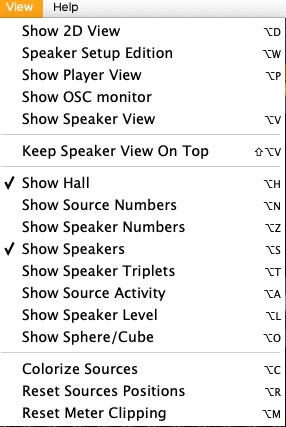

# 5. SpatGRIS

• *SpatGRIS* fait de la spatialisation et de la localisation.

• *SpatGRIS* est un enregistreur et un lecteur.

• *SpatGRIS* fabrique des dispositifs de haut-parleurs.

## 5.1. Introduction

*SpatGRIS* comporte trois composantes qui sont sauvegardées de manière
indépendante : Project, Speaker Setup et Settings.

• **Save Project**. Un projet est couplé à une œuvre qui contient un
certain nombre de sources (sorties du SAN) et le Mode utilisé. C'est le
composant en haut à droite de *SpatGRIS*.

• **Save Speaker Setup**. Un speaker setup est couplé à une installation
placée dans un espace et à l'algorithme utilisé. C'est la section qui
est montrée dans *SpeakerView*.

• **Save Settings**. Les réglages de l'utilisateur sont liés à une
station de travail — ordinateur et interface audio — y compris les
sorties stéréo utilisées pour la réduction stéréo (même sans les
afficher). La plupart des paramètres sont affichés dans la barre
d'information. Cliquez sur la barre d'information ou sur Settings dans
le menu File (Cmd-,).

NOTE: Les modes DOME et CUBE sont sauvegardés dans les Speaker Setup et
les Projects, mais le mode HYBRID n'est sauvegardé que dans les projets.
Le dernier document ouvert — qu'il s'agisse d'un Speaker Setup ou d'un
Project — détermine le Mode.

La fenêtre de *SpatGRIS* est divisée en différentes zones :

• Sources

• VU Meters.

• Settings et Info.

• Controls.

• Recording.

*SpeakerView* affiche les haut-parleurs dans la vue 3D.

## 5.2. SpeakerView

À partir de la version 3.3.3 de *SpatGRIS*, la représentation 3D des
haut-parleurs est prise en charge par une application indépendant qui se
nomme *SpeakerView* Ce changement a été nécessaire afin de satisfaire
aux exigences des processeurs Apple Silicon pour Mac. Tout est mieux
ici: la transparence des haut-parleurs, la lisibilité des chiffres et la
fluidité des mouvements ont été améliorés de manière spectaculaire.

*SpeakerView* est montré ici avec la nouvelle fonction Show Hall:

### 5.2.1. Visibilité et raccourcis-clavier

*SpeakerView* s'affiche indépendamment de *SpatGRIS*. Par défaut, il
s'affiche en même temps que ce dernier. Mais il peut être ouvert ou
fermé de manière indépendante (Mac: Opt-V; Windows: Alt-V).

Les raccourcis claviers présents dans le menu View de *SpatGRIS*
contrôlent les options d'affichage dans *SpeakerView*:

### 5.2.2. Deux applications distinctes

Bien que *SpeakerView* ressemble à la représentation 3D qui existait
dans les versions de SpatGRIS antérieures à 3.3.0, il s'agit d'une
application distincte. On peut la déplacer et la dimensionner de manière
indépendante. On peut aussi décider de la forcer à rester au premier
plan par rapport à *SpatGRIS* (Keep SpeakerView On Top).

NOTE : *SpeakerView* est une application autonome, mais l'utilisateur
n'a pas à s'en préoccuper, *SpatGRIS* s'occupera de tout. Nous
recommandons même fortement de ne pas lancer *SpeakerView* à partir du
Finder ou du Dock. S'il est ouvert de cette manière, voici le message
d'avertissement qui s'affichera :

## 5.3. Modifier la configuration de haut-parleurs et non la spatialisation

La caractéristique la plus intéressante de *SpatGRIS* est que les
Sources, qui proviennent du SAN et représentent l'audio et la
spatialisation de votre travail, sont indépendantes des haut-parleurs.
Ainsi, si vous avez initialement défini une structure de spatialisation
très complexe pour une configuration de haut-parleurs spécifique, vous
pouvez la jouer sur n'importe quelle autre configuration de
haut-parleurs par la suite, en particulier en mode DOME. Il vous suffit
de changer la configuration des enceintes d'un endroit à l'autre.

Voici un exemple d'une pièce conçue pour un système de 16 enceintes (à
gauche), présentée sur un système de 24 enceintes totalement différent
(à droite), en passant simplement d'un système à l'autre.

Comme vous pouvez le voir, toutes les sources restent exactement aux
mêmes coordonnées. Elles seront jouées par des enceintes différentes,
mais entendues au même endroit dans la salle de concert.

## 5.4. Réglages (Settings)

Audio Settings

• Audio device type: Core Audio (default).

• Audio input device: *BlackHole* (idéalement).

• Audio output device: votre interface audio.

• Sampling Rate (Hz): de 44100 à 192000, selon votre interface audio.

• Buffer Size (spls): from 16 to 2048. Ajustez la taille de la mémoire
tampon à la même valeur dans votre SAN et dans *SpatGRIS*.

General Settings:

• OSC Input Port: la valeur par défaut est 18032, ce qui correspond à
celle de *ControlGRIS2*. Si vous souhaitez utiliser un autre dispositif
OSC entrant, utilisez ce numéro de port comme port de sortie de ce
dispositif, sinon vous devez modifier ce numéro en conséquence.

**Close**

Vos paramètres sont automatiquement sauvegardés. Sous le nom de la
version de *SpatGRIS*, le document se trouve ici (Mac) :

• ~/Bibliothèque/Application Support/GRIS/SpatGRIS.0.0 (par exemple).

## 5.5. Contrôles

## 5.6. Le DOME et le CUBE

En mode DOME, il est possible de placer les sources sur la surface du
dôme formé par les enceintes, tandis qu'en mode CUBE, il est possible de
déplacer et de placer les sources à l'intérieur et à l'extérieur du
speaker setup.

### 5.6.1. DOME

Le DOME, basé sur le VBAP (Vector Base Amplitude Panning), permet à
l'utilisateur de spatialiser le son sur un dôme de haut-parleurs en
fonction de l'amplitude relative de trois haut-parleurs (par opposition
à deux dans le panoramique stéréo). Le dôme est donc constitué de
triangles de haut-parleurs. De cette manière, le son peut se propager de
manière fluide sur la surface du dôme, sans bosses ni trous.

Il est possible de voir les triangles en choisissant Show Speaker
Triplets (Opt-T) dans le menu View. Si vous avez la chance d'utiliser
une sphère complète, il est possible de l'afficher (Opt-O) !

### 5.6.2. CUBE

Depuis la version 3.2.0, le mode CUBE est basé sur l'algorithme MBAP
(Matrix Base Amplitude Panning) et permet de placer une source n'importe
où dans un espace représenté par un cube. Mais il n'est pas limité à la
forme d'un cube. Toute configuration de haut-parleurs peut être placée
dans un cube (y compris un dôme !). Par conséquent, toute installation
sonore ou situation de concert peut être simulée ici. En mode CUBE, la
distance d'une source sortant du speaker setup est prise en compte pour
simuler le comportement naturel du son qui s'éloigne.

Comme son nom l'indique, l'algorithme est basé sur une matrice
tridimensionnelle précalculée de plusieurs points par haut-parleur qui
détermine l'amplitude d'une source à une position spécifique.

## 5.7. Le mode HYBRID: DOME et CUBE dans le même projet

Le mode HYBRID n'est pas vraiment un nouvel algorithme, mais une
combinaison des algorithmes DOME et CUBE. Le mode HYBRID peut être
sélectionné dans la section Algorithm :

Le menu Sources est alors modifié pour offrir la possibilité de choisir
entre le comportement dôme ou cube indépendamment pour chaque source :

Le mode HYBRID utilise l'algorithme DOME, ce qui signifie que la
configuration des enceintes doit être un dôme (si ce n'est pas le cas,
il vous sera demandé de le convertir) à l'intérieur duquel les sources
peuvent être déplacées selon les comportements CUBE où il est possible
de déplacer le son à l'intérieur ou à l'extérieur du dôme de
haut-parleurs. En mode HYBRID, les spans conservent leur comportement
habituel du mode dôme ou du mode cube.

### 5.7.1. Qu'est-ce qui est sauvegardé en mode HYBRID ?

Deux types d'informations sont enregistrés avec un projet en mode HYBRID
:

• Le mode HYBRID lui-même est sauvegardé exclusivement avec le projet.

• La sélection de l'algorithme DOME ou CUBE pour chaque source est
également sauvegardée avec le projet.

Si un ancien projet HYBRID (antérieur à la version 3.1.8) est ouvert en
mode DOME ou CUBE, les sélections concernant les sources n'apparaîtront
pas. Il faudra choisir manuellement le mode HYBRID pour les voir
apparaître. Mais si vous avez déjà ouvert un speaker setup HYBRID, elles
s'afficheront automatiquement.

### 5.7.2. Quel mode est chargé en fonction de l'ordre d'ouverture du Speaker Setup et du Project?

En règle générale, c'est toujours le dernier document ouvert — Speaker
Setup ou Project — qui détermine l'algorithme utilisé par *SpatGRIS*.

Un Speaker Setup (SS) suivi d'un Project (P) :

1.1. SS Dome + P Dome = Dome.

2.1. SS Cube + P Cube = Cube.

3.1. SS Dome + P Cube = Cube. Le dôme SS est converti dans un SS cube.
La forme du SS ne change pas, puisque l'algorithme du Cube accepte tous
les dômes (ceci peut être confirmé en ouvrant la fenêtre Speaker Setup
Edition). Avant de fermer le SS, il vous sera demandé de sauvegarder les
modifications.

4.1. SS Cube + P Dome = Dome. Le SS cube est converti en dôme après
l'approbation du message de conversion.

5.1. SS Dome + P Hybrid = Hybrid.

6.1. SS Cube + P Hybrid = Hybrid. Le SS Cube est converti en Dôme après
approbation du message de conversion.

Dans l'ordre inverse :

1.2. P Dome + SS Dome = Dome.

2.2. P Cube + SS Cube = Cube.

3.2. P Cube + SS Dome = Dome. Le projet Cube a été transformé en Dome.

4.2. P Dome + SS Cube = Cube. Le projet Dome a été transformé en Cube.

5.2. P Hybrid + SS Dome = Hybrid. C'est la seule exception où Hybrid est
prioritaire, bien qu'il ait été chargé en premier. C'est parce que les
projets hybrides ne fonctionnent que sur les SS Dome.

6.2. P Hybrid + SS Cube = Cube. Hybrid disparaît de la vue puisque nous
venons de passer à Cube. C'est normal. En sélectionnant ensuite
manuellement Hybrid, le SS Cube est converti en Dôme après l'approbation
du message de conversion. Les informations sauvegardées du P Hybrid sont
alors récupérées.

### 5.7.3. Attenuation settings dans le mode CUBE ou HYBRID

Dans les modes CUBE et HYBRID, il y a un cercle intérieur et un cercle
extérieur au milieu du Speaker Setup. Dans le cercle intérieur,
l'atténuation et/ou le filtrage ne sont pas appliqués. En dehors du
cercle intérieur, l'atténuation et/ou le filtrage peuvent être appliqués
pour simuler la disparition d'un son qui s'éloigne. Au cercle extérieur,
l'atténuation et le filtrage atteignent leurs valeurs maximales. Vous
pouvez indiquer ces valeurs maximales dans les menus Attenuation
settings. En mode HYBRID, les Attenuation settings ne fonctionnent que
pour les sources CUBE.

En fait, le cercle intérieur est une sphère à l'intérieur de laquelle
les paramètres d'atténuation commencent à être calculés à partir du
"plancher", c'est-à-dire à partir des coordonnées (0,0, 0,0) :

Les paramètres Attenuation settings :

• On/Off

• Volume (dB): de 0 à -72, par paliers de -12 dB.

• Filtrage (Hz): de 125 à 16000, par paliers d’octaves.

• Le volume et le filtrage sont indépendants.

• En élévation, l'atténuation commence en haut (Extended Top) et en bas
(Extended Top and Bottom) du cube.

• Les Attenuation settings fonctionnent également en mode STEREO et
BINAURAL.

NOTE : les Attenuation Settings sont enregistrés dans le projet.

### 5.7.4. Conversion de DOME en CUBE et vice versa

Dans le cas du passage de DOME à CUBE, *SpatGRIS* utilise les
coordonnées XYZ du Speaker Setup pour garder l'intégrité du Speaker
Setup. Cela ne s'applique pas au passage de CUBE à DOME, puisque dans
l'algorithme VBAP, la distance est toujours ajustée à 1,00. L'élévation
et la distance n'ont pas le même comportement dans les algorithmes DOME
et CUBE. Un Speaker Setup conserve son apparence et ses coordonnées XYZ
lors de la transition de l'algorithme DOME à l'algorithme CUBE, mais pas
l'inverse.

### 5.7.5. Spatialisation en 2D et 3D

*SpatGRIS* est capable de spatialiser en 2D et 3D en mode DOME ou CUBE.
Il peut être utile d'utiliser *SpatGRIS* en 2D avec des SANs qui sont
uniquement stéréo comme Ableton Live et Pro Tools native. Cela donne à
ces SANs stéréo la possibilité de gérer des environnements
multienceintes comme les standards du cinéma. Mais bien sûr, la vraie
puissance de *SpatGRIS* réside dans ses capacités 3D.

Les images suivantes présentent un exemple de configuration de
haut-parleurs en 2D — une octophonie — et une configuration en 3D — un
cube de 24 (3x8) haut-parleurs.

## 5.8. Dispositif de haut-parleurs

La conception d'un dispositif de haut-parleurs est la première étape du
processus. Elle s'effectue dans la fenêtre *Speaker Setup Edition* (menu
View, Opt-W).

Un menu Templates est fourni avec différents Speaker Setup au format
DOME ou CUBE. Les Speaker Setup dans les Templates ne peuvent pas être
modifiés. Vous pouvez les utiliser, les éditer et les sauvegarder sous
le nom de votre choix en utilisant Save Speaker Setup As dans le menu
File.

### 5.8.1. Speaker Setup Edition

Depuis l'introduction du MBAP (à partir de la version 3.20) en mode
CUBE, le paramètre Global Sound Diffusion permet de modifier la
diffusion du son de manière globale pour l'ensemble des haut-parleurs.
Une localisation précise est obtenue avec une petite valeur, des valeurs
plus élevées donneront une image spatiale floue. Ce paramètre peut
également influencer la fluidité des trajectoires.

À l'exception de la distance, qui est fixée à 1,00 en mode DOME (par
définition), les paramètres de speaker setup peuvent être définis par
des valeurs polaires dans DOME (Azimuth, Elevation) ou par des valeurs
cartésiennes dans CUBE (X, Y, Z). En mode DOME, les valeurs cartésiennes
sont grisées. En mode CUBE, les valeurs polaires sont grisées.

### 5.8.2. Ordre des haut-parleurs et représentation visuelle

En cliquant en haut de chaque colonne (sauf pour Gain et Highpass) dans
la fenêtre Speaker Setup Edition, l'ordre des haut-parleurs peut être
organisé. La colonne la plus importante est celle de la sortie, dans
laquelle vous pouvez déplacer manuellement ou automatiquement chaque
haut-parleur. Cet ordre sera reflété dans l'ordre des VU-mètres des
haut-parleurs.

Ordre consécutif :

Ordre pair et impair suivi de sorties directes :

Voici un exemple d'ordre des haut-parleurs qui représente la position
réelle des haut-parleurs dans un studio par rapport à l'axe Y (voir
5.9.1 pour plus d'informations). On peut voir sur la section VU-mètre
des haut-parleurs comment l'énergie est distribuée de la gauche vers la
droite dans le dôme. Les enceintes 11 et 20 sont au centre, et les subs
à l'extrême gauche et droite, comme dans un studio. Toutes les autres
enceintes sont également réparties le long de l'axe Y :

### 5.8.2.1 Groupes de haut-parleurs

Il est possible de créer des groupes de haut-parleurs, de manière à pouvoir effectuer des opérations de mouvement groupées. Celà permet aussi de rendre la création de certaines configuration d'haut-parleurs plus aisée.

Deux pré-réglages de groupes de haut parleurs sont disponibles, les anneaux (ring) et les polyhèdres.

Pour le pré-réglage "ring", vous pouvez choisir le nombre de haut-parleurs dans l'anneau, l'élévation initiale, la "distance" qui correspondra au rayon de l'anneau et l'angle de rotation "yaw" initial.

Pour le pré-réglage polyhèdre, vous pouvez choisir des polyhèdres avec plus ou moins de faces. Ce réglage est pensé en fonction de haut parleurs multidirectionnels et a été conçu pour fonctionner en mode Dome (ou hybride).

Une fois un groupe créé il est possible de déplacer le groupe complet dans l'espace 3d comme on ferait avec n'importequel autre haut parleur. Une petite icone d'engrenage permet aussi d'effectuer des rotations sur le groupe.

Il est aussi possible de modifier la position relative des haut-parleurs à l'intérieur d'un groupe et d'enlever ou d'ajouter des haut-parleurs dans un groupe en cliquant et glissant ceux-ci à l'intérieur ou à l'extérieur du groupe.

### 5.8.3. Exigences minimales

Le DOME, en particulier, a besoin de conditions minimales pour effectuer
les calculs VBAP. Si la configuration du haut-parleur ne répond pas à
ces exigences, vous serez averti par un ou deux de ces messages :

### 5.8.4. Sorties directes

Une source sonore peut être envoyée directement à un haut-parleur via
une sortie directe. Il existe deux types de sorties directes dans
*SpatGRIS*, ce qui n'était pas le cas auparavant.

#### Sorties directes indépendantes

Il existe des sorties
directes indépendantes destinées à des utilisations spéciales comme les
subwoofers. Ces enceintes sont identifiées par un rectangle orange dans
la fenêtre Speaker Setup Edition.

Leur placement dans la configuration n'est pas très important,
puisqu'elles sont indépendantes de la spatialisation, mais si vous avez
l'intention de mixer votre projet dans un format à deux canaux, leur son
sera placé dans l'image stéréo en fonction de leur position
gauche-droite. Ils sont représentés en noir dans la vue 3D des
enceintes.

#### Sorties directes spatialisées

Il s'agit d'une nouvelle fonctionnalité de *SpatGRIS*. Tout haut-parleur
de la configuration peut être utilisé comme sortie directe et continuer
à être utilisé par les algorithmes de spatialisation. Chaque source a
une zone de texte de sortie directe qui est vide par défaut. N'importe
quel numéro de haut-parleur peut y être placé. La différence entre les
types de sortie directe est que les sorties indépendantes ne sont
utilisées qu'à cette fin. Il n'y a pas de distinction dans la vue 3D du
haut-parleur pour les sorties directes spatialisées.

Les sorties directes spatialisées ont été créées par Samuel Béland, une
amélioration majeure de *SpatGRIS*.

On peut voir la distinction lors de la sélection d'une sortie directe.
Les premiers chiffres, en haut de la colonne (17-18) sont des sorties
directes indépendantes. Les autres numéros (1-16) peuvent être utilisés
comme sorties directes spatialisées.

Dans l'exemple suivant, la source 5 est envoyée directement au
haut-parleur 9 et la source 8 au haut-parleur 14. Les deux enceintes 9
et 14 restent dans la configuration DOME. Enfin, les sources 15-16 sont
envoyées aux sorties directes indépendantes 17-18 :

NOTE: Comme les sorties directes sont affectées à des sorties
spécifiques, si vous ouvrez un projet avec un nombre de sorties directes
différent de celui du speaker setup que vous utilisez, certaines sorties
risquent d'être coupées ! Il n'y a pas d'avertissement à ce sujet !

### 5.8.5. Show Speaker Numbers

L'emplacement des haut-parleurs et leurs numéros peuvent être visualisés
dans la fenêtre 3D en choisissant l'option Show Speaker Numbers (Opt-Z).
Les sorties directes sont affichées en noir. Un clic sur un haut-parleur
ou sur son numéro le sélectionne ; un clic droit le désélectionne. Dans
l'image ci-dessus, le haut-parleur 3 est sélectionné et les sorties
directes indépendantes 17-18 sont en noir. Show Speaker Numbers ne
fonctionne que si l'option Show Speakers est activée dans le menu View.

## 5.9. Sources et Speakers

*SpatGRIS* reçoit les signaux audios du SAN et les envoie aux
haut-parleurs. Les deux sections principales sont les Sources (provenant
du SAN via *BlackHole*) et les Speakers. Il y a aussi les sorties
directes qui sont envoyées directement des sources vers ces
haut-parleurs (pour les subwoofers, par exemple).

Dans cet exemple, les sources sont composées de 4 X sources
octophoniques (1-32), plus 1 X source stéréo (33-34), 1 X sorties
directes stéréo spatialisées (35-36 envoyées à 53-54) et 1 X sorties
directes indépendantes (37-38, assigné à 5-6) pour un total de 38
sources identifiées par différents groupes de couleurs, distribuées sur
un dôme de 32 haut-parleurs avec 2 sorties directes indépendantes (5-6).

### 5.9.1. Mute et Solo

Chaque source et chaque haut-parleur disposent d'une touche Mute et
d'une touche Solo.

### 5.9.2. Indicateurs de crête et réinitialisation

Un indicateur de crête est présent pour les Sources et les Speakers. Il
existe une fonction générale de Reset Meter Clipping dans le menu View
(Opt-M).

## 5.10. Les réductions stéréo

### 5.10.1. STEREO

Il existe un mode STEREO pour écouter un projet complexe sur une paire
de haut-parleurs. Tous les sons sont envoyés aux enceintes
correspondantes en fonction de leur emplacement (gauche à gauche, droite
à droite, pas d'axe avant-arrière, pas d'élévation). Lorsque STEREO est
sélectionné, l'option de routage stéréo apparaît pour vous permettre de
choisir les sorties de votre choix, en fonction de votre carte son.
Seules les sorties de votre carte son sont disponibles pour la réduction
stéréo. En cas d'utilisation de la carte de son interne de l'ordinateur,
les sorties sont affectées aux numéros 1 et 2.

Ce mode peut être utilisé pour réduire un projet multicanal en stéréo.
Les sources sont simplement placées sur l'axe Y, de gauche à droite.
Seul le Azimuth Span est utilisé en mode STEREO, et non pas le Elevation
span. Gardez à l'esprit que les sources, à l'exception des sorties
directes, ne sont jamais placées directement sur un haut-parleur, mais
sur plusieurs haut-parleurs — au moins trois sur un DOME, beaucoup plus
sur un CUBE. Ainsi, la projection des sources n'est probablement pas
aussi précise qu'elle ne l'est sur cette représentation !

### 5.10.2. BINAURAL

Cet algorithme a été mis en œuvre pour aider les utilisateurs à
travailler sur la spatialisation 3D depuis leur maison lorsque l'accès à
un dôme de haut-parleur est limité ou indisponible. Il est basé sur une
fonction de transfert liée à la tête (Head Related Transfer Function,
HRTF). La HRTF est une fonction qui reproduit la façon dont nous
percevons la localisation des sons dans l'espace. Il s'agit d'un
ensemble de calculs de phase et d'amplitude pour l'écoute au casque.
Elle est principalement conçue pour les reproductions 5.1 ou l'écoute
immersive au casque, situations que l'on retrouve dans les jeux vidéo et
l'industrie de la réalité virtuelle. Pour minimiser le nombre de calculs
(HRTF peut être très exigeant en termes de puissance de calcul),
*SpatGRIS* calcule d'abord une spatialisation VBAP sur 16 haut-parleurs
(avec le BINAURAL_SPEAKER_SETUP, rendu invisible dans cette version) et
transfère ensuite le résultat à HRTF. Ne vous inquiétez pas, même si
votre configuration de haut-parleurs contient plus de 16 haut-parleurs,
aucune information n'est perdue au cours du processus. Les modes
BINAURAL utilisent les sorties stéréo de votre choix. Les deux Spans
sont disponibles en mode BINAURAL.

Pour diverses raisons et à cause de considérations techniques, le niveau
sonore de sortie du mode STEREO diffère considérablement de celui du
mode BINAURAL, en fonction du nombre de sources. Veuillez ajuster votre
niveau d'écoute en conséquence.

NOTE: Les Attenuation Settings utilisés en mode CUBE ou HYBRID sont
fonctionnels dans les réductions stéréo.

## 5.11. Enregistrement

Lorsque la composition de la spatialisation est terminée, deux options
s'offrent à vous :

1\. Jouer le morceau "en direct" avec votre SAN et *SpatGRIS*.

2\. Enregistrer la spatialisation sur autant de pistes audios que le
nombre de haut-parleurs de la configuration.

*SpatGRIS* enregistre des fichiers mono (AIFF ou WAV selon vos
préférences) ou un fichier entrelacé.

Pour enregistrer : appuyez sur le gros bouton rouge en bas à droite de
la fenêtre principale.

Une fenêtre pop-up s'ouvre alors, vous permettant de spécifier :

• L'emplacement des fichiers enregistrés.

• Leur nom

• Le format : WAV ou AIFF.

• Le nombre de fichiers : Fichiers mono ou entrelacés.

• La possibilité d'exporter le Speaker Setup pour la fonction Player
(chapitre 6).

Le fait d'appuyer sur le bouton d'enregistrement démarre
l'enregistrement et la minuterie, et le bouton d'enregistrement devient
clignotant. Une fois l'enregistrement terminé, vous pouvez appuyer à
nouveau sur le bouton d'enregistrement pour l'arrêter. Vous pouvez
ensuite importer les fichiers monos séparés (ou un fichier entrelacé)
dans n'importe quelle station de travail audionumérique pour jouer votre
morceau en concert.

Gardez à l'esprit qu'avec les fichiers entrelacés, il y a certaines
limites, et que ces limites sont atteintes assez rapidement sur les
grands projets :

\- AIFF est limité à 2 Go.

\- WAV est limité à 4 Go[^4gb-footnote].

De plus, si vous enregistrez un fichier entrelacé avec de nombreux
canaux, vous trouverez très peu de SAN capables de l'ouvrir. Il est donc
préférable d'enregistrer des fichiers monos.

[^4gb-footnote]: Les formats CAF (Core Audio Format) et WAV RF64 seront éventuellement mis en œuvre, ce qui permettra de dépasser les 4 Go.
