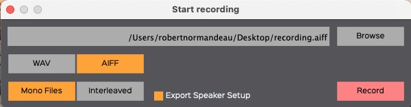

# 6. PLAYER

*SpatGRIS,* à partir de la version 3.2, introduit un nouvel outil, le
PLAYER, qui permet d'utiliser *SpatGRIS* comme logiciel autonome pour
jouer n'importe quelle pièce enregistrée par *SpatGRIS* avec n'importe
quelle configuration de haut-parleurs. L'idée principale du PLAYER est
de faciliter la diffusion d'œuvres multicanaux parmi différent.e.s
utilisateur.rice.s et sur différentes configurations de haut-parleurs.
Les œuvres réalisées avec un Speaker Setup DOME peuvent être jouées sur
un Speaker Setup CUBE et vice versa. Les sorties directes sont assignées
automatiquement, mais peuvent être ajustées manuellement par la suite.

## 6.1. Effectuer un enregistrement pour le PLAYER

La procédure d'enregistrement d'une pièce pour la reproduction avec le
PLAYER est presque identique à celle d'un enregistrement normal. La
principale différence est que, en plus de l'enregistrement des fichiers
audio eux-mêmes, vous devez exporter les coordonnées du Speaker Setup
utilisé en activant la fonction Export Speaker Setup. Les fichiers
audios et le Speaker Setup seront placés dans le même dossier et doivent
y rester pour que le PLAYER fonctionne correctement. Ces coordonnées
seront utilisées par le PLAYER pour positionner correctement les sources
dans n'importe quel Speaker Setup.

NOTE: Seuls les fichiers monos fonctionnent avec le PLAYER. Vous
obtiendrez un message d'erreur si vous essayez d'ouvrir un fichier
entrelacé. La raison en est que le PLAYER utilise les numéros des
sorties dans le nom des fichiers audio pour la spatialisation. Il n'y a
aucun moyen d'encoder cette information dans un fichier audio entrelacé.

## 6.2. Ouvrir et lire un projet avec le PLAYER

Une fois l'enregistrement terminé, vous pouvez envoyer le dossier
contenant les fichiers sonores et le Speaker Setup à un.e auditeur.trice
qui utiliserait un autre dispositif de haut-parleurs. Vous pouvez aussi
l'utiliser vous-même pour écouter l'enregistrement sur un autre
dispositif de haut-parleurs.

### 6.2.1. Ouvrir le Speaker Setup pour l'écoute

Ouvrir le Speaker Setup dans *SpatGRIS* sur lequel vous avez l'intention
d'écouter le travail spatialisé. Il peut s'agir d'une configuration
personnalisée ou d'une configuration provenant des Templates.

### 6.2.2. Ouvrir la fenêtre PLAYER et charger les fichiers

View Menu —\> Show Player View

Load the audio files and Speaker Setup folder:

Le PLAYER affiche maintenant la forme d'onde des fichiers audio :

Le PLAYER affiche également le dispositif de haut-parleurs avec lequel
l'œuvre a été enregistrée. L'emplacement des haut-parleurs d'origine est
indiqué en rouge :

Veuillez noter que le projet actuel chargé dans *SpatGRIS* est remplacé
par le projet de l'enregistrement.

### 6.2.3. Jouer la pièce

Le PLAYER est maintenant prêt à jouer la pièce. Il suffit d'utiliser les
boutons Play et Stop. Il est également possible de cliquer n'importe où
dans le fichier audio pour démarrer la lecture à partir de cet endroit.

### 6.2.4. DOME dans CUBE ou CUBE dans DOME

Voici un exemple d'enregistrement réalisé avec un dôme
(Dome20(8-6-4-2)Subs4) et joué dans un cube (Cube24(2X12)Subs2). Comme
on peut le voir, la forme du dôme original est bien reproduite dans le
cube d'écoute :

Voici un autre exemple montrant la situation inverse, un enregistrement
de cube (Cube24(3X8)Subs2) joué dans un dôme (Dome20(8-6-4-2)Subs4).
Comme on peut le voir, la forme du cube original est bien reproduite
dans le dôme d'écoute :

### 6.2.5. Les sorties directes dans le PLAYER

Le PLAYER essaiera d'assigner les sorties directes originelles aux
sorties directes du dispositif d'écoute.

Dans le premier exemple, la configuration d'origine comportait quatre
sorties directes (numéros **6-12-18** et **24**). Mais dans la
configuration d'écoute, il n'y a que deux sorties directes (**25** et
**26**). Le PLAYER a assigné alternativement les numéros de sorties
directes originelles aux sorties directes disponibles dans la
configuration d'écoute. Ces numéros de sortie peuvent être réglés
manuellement par la suite :

## 6.3. Sauvegarder un projet PLAYER

Si vous avez modifié un élément du projet PLAYER, vous pouvez le
sauvegarder en utilisant le bouton Save Player Project. Ce document sera
automatiquement placé dans le même dossier que les fichiers audios et la
configuration des enceintes. Le bouton File Saved ! (Fichier sauvegardé)
clignotera pendant un certain temps au cours du processus. Tous les
fichiers doivent rester dans le même dossier. La prochaine fois que vous
utiliserez le bouton Load audio files and Speaker Setup folder, tout
sera placé correctement en fonction de la façon dont il a été
sauvegardé.

NOTE: Un projet du PLAYER reste actif tant que la fenêtre PLAYER est
ouverte. Lorsque vous la fermez, *SpatGRIS* passe à son mode d'entrée
normal, attendant que l'audio et l'OSC proviennent d'un séquenceur ou de
tout autre logiciel.
