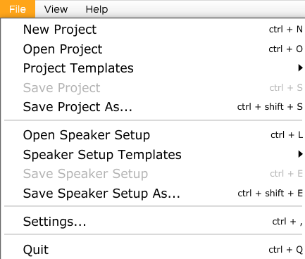
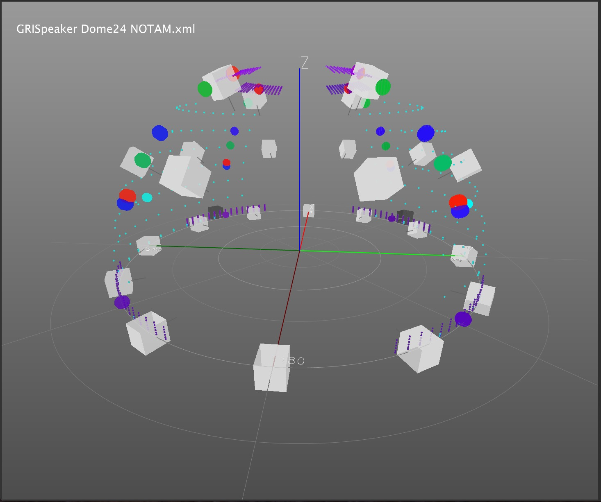
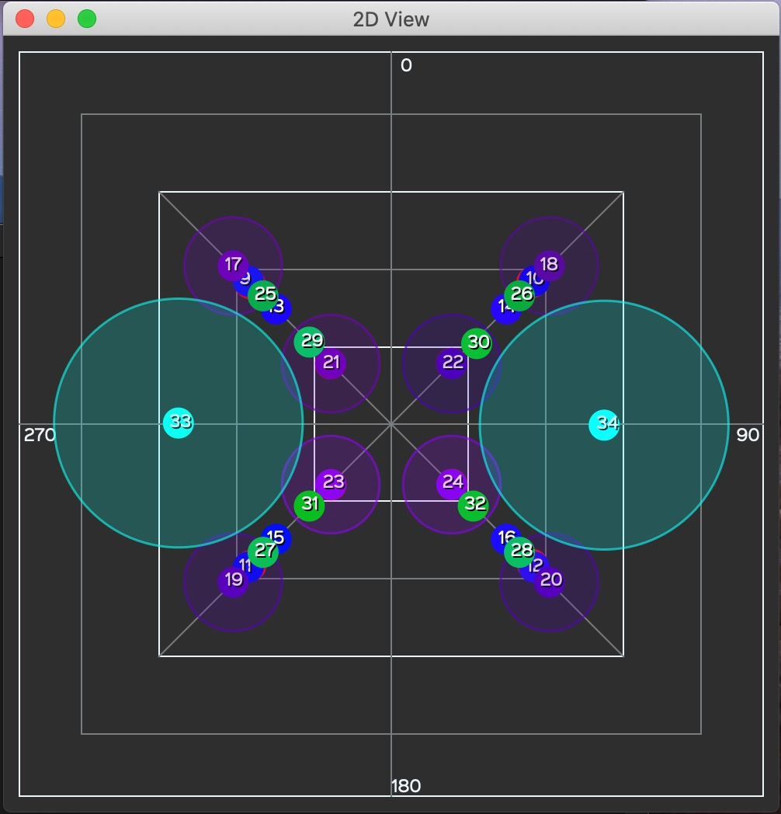
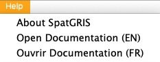

# 7. Menus

## 7.1. Menu File

Dans le menu File (Fichier), vous trouverez toutes les fonctions liées
au projet, où vous pourrez :

• Créer
un New Project.

• Ouvrir un projet existant.

• Ouvrir un projet à partir du dossier Project Templates. Ces modèles ne
peuvent pas être modifiés, mais ils peuvent être édités et enregistrés
en tant que nouveau fichier.

• Save Project or Save As — pour faire une copie.

• Ouvrir un Speaker Setup.

• Ouvrir un Speaker Setup à partir du dossier Speaker Setup Templates.
Ces modèles ne peuvent pas être modifiés, mais ils peuvent être édités
et sauvegardés dans un nouveau fichier.

• Save Speaker Setup or Save As — faire une copie.

• Ouvrir la fenêtre Settings.

## 7.2. Menu View

Dans le menu View, vous pouvez choisir différentes perspectives pour
visualiser les haut-parleurs et les sources en temps réel. La touche
modificatrice de ce menu est Option (Opt) pour Mac et Alt pour Windows.

• Show 2D view : Une vue en 2D
depuis le haut du dispositif est affichée, montrant uniquement les
sources.

• Speaker Setup Edition : Ouvre une fenêtre permettant d'accéder à tous
les paramètres d'une configuration de haut-parleurs.

•Show Player View: Ouvre la fenêtre du Player

• Show OSC monitor : Pour les spécialistes ! Pour aider à dépanner les
flux de messages OSC entrants.

• Show SpeakerView: Ouvre la fenêtre 3D des haut-parleurs

—

Keep Seaker View On Top

—

• Show Hall: Affiche les murs de la salle

• Show Numbers : Permet d'afficher ou de masquer les numéros des sources
et/ou des enceintes affichées.

• Show Speakers : Permet d'afficher ou de masquer les haut-parleurs dans
la vue 3D.

• Show Speakers Triplets : Affiche ou cache les triplets dans la vue 3D
en mode DOME. Il n'y a pas de triplets en mode CUBE.

• Show Source Activity: Cette option permet de voir la position et les
trajectoires des sources (gros points) et leurs valeurs d'azimut et
d'élévation (petits points), selon les données envoyées par le plugiciel
*ControlGRIS2*. Notez qu'il n'y a rien à voir lorsque la SAN est
arrêtée. Le seuil est fixé à -70 dB. Lorsque cette option n'est pas
sélectionnée, toutes les sources faisant partie d'un projet sont
affichées, même lorsque la SAN est arrêtée. Cette option peut être utile
pour vérifier qu'il n'y a pas de canaux OSC en double envoyés par
*ControlGRIS2* vers *SpatGRIS*.

<table>
<colgroup>
<col style="width: 46%" />
<col style="width: 53%" />
</colgroup>
<thead>
<tr class="header">
<th><em>Show Source Activity</em> Off: Affiche la position de toutes les
sources</th>
<th><em>Show Source Activity</em> On: Affiche uniquement l'activité
réelle des sources en mode lecture</th>
</tr>
</thead>
<tbody>
</tbody>
</table>

• Show Speaker Level : Indique la quantité d'énergie délivrée par chaque
haut-parleur. Du gris (rien) au blanc (maximum).

• Show Sphere/Cube : Si vous avez la possibilité de jouer dans une
sphère ou un cube complet !

—

• Colorize Sources : Cette option vous permet de régler toutes les
sources sur une couleur différente dans le spectre visible, du rouge au
violet. Attention, cette option efface toutes les couleurs
personnalisées déjà en place.

• Reset Sources Position: Lorsque vous passez d'un projet à un autre,
*SpatGRIS* peut parfois afficher les sources du projet précédent.
Utilisez cette option pour effacer la vue 3D.

• Reset Meter Clipping: Les indicateurs de crête peuvent être
réinitialisés individuellement en cliquant dessus, ou globalement avec
le raccourci Opt-M.

## 7.3. Nommer et sauvegarder

*SpatGRIS* comporte trois composantes qui sont sauvegardées
indépendamment l'une de l'autre : Project, Speaker Setup and Settings.

• Save Project. Un projet est couplé à une œuvre.

• Save Speaker Setup. Un speaker setup est couplé à une installation
physique placée dans un espace.

• Save Settings. Ces paramètres sont liés à une station de travail
(ordinateur et interface audio), y compris les sorties stéréo utilisées
pour les réductions stéréo.

Speaker setups and Project documents sont enregistrés au format .xml. Il
n'y a pas de distinction entre les deux. Le document de projet n'inclut
pas le Speaker setup et ils sont donc indépendants. Par conséquent, nous
recommandons fortement deux choses :

• Ajoutez le mot "Speaker Dome" ou "Speaker Cube" au nom de vos Speaker
Setups et "Project Dome", "Project Cube" ou "Project Hybrid" au nom de
vos fichiers de projet.

• Enregistrez les Speaker Setup DOME ou CUBE dans deux dossiers
distincts dans un dossier nommé Speakers.

• Enregistrez les projets *SpatGRIS* dans trois dossiers distincts à
l'intérieur d'un dossier nommé Projects.

Les menus Templates que nous fournissons avec *SpatGRIS* sont un bon
exemple de la bonne classification.

• Avertissements concernant le format du document

*SpatGRIS* se souvient toujours du dernier speaker setup et du dernier
projet ouverts.

Si vous essayez d'ouvrir un projet *SpatGRIS* avec la commande Load
Speaker Setup (ou l'inverse), vous serez averti :

NOTE : Les documents *SpatGRIS* adoptent un nouveau format et ne sont
pas rétrocompatibles avec les anciennes versions de *SpatGRIS*. En
essayant d'ouvrir un projet *SpatGRIS* ou un dispositif de haut-parleurs
de la version 2, vous obtiendrez l'un de ces messages effrayants ! Vos
fichiers sont corrects, mais ils ne sont pas compatibles :

## 7.4. Représentations

Les vues 3D et 2D de *SpatGRIS* sont disponibles pour les modes DOME et
CUBE. Dans le mode DOME, les sources se trouvent sur la surface et les
Spans s'étendent le long de cette surface. En mode CUBE, les sources
peuvent être placées n'importe où dans l'espace et les Spans s'étendent
localement autour des sources.

### 7.4.1. Représentation 3D

La fenêtre 3D en mode DOME (à gauche) ou en mode CUBE (à droite) de la
même session. Les haut-parleurs et les sources sont représentés :

### 7.4.2. Représentation 2D

La vue 2D en mode DOME (à gauche) ou en mode CUBE (à droite) de la même
session. Seules les sources sont représentées :

## 7.5. Performance et charge de travail du CPU

Les performances de la combinaison *ControlGRIS2/SpatGRIS* dépendent
largement des différents paramètres de votre projet. En règle générale,
un projet avec 64 canaux audios envoyés à 64 haut-parleurs fonctionnera
parfaitement bien sur des ordinateurs récents. Nous avons testé des
projets avec plus de 100 canaux audios sur une configuration de 128
haut-parleurs et cela fonctionnait toujours bien !

Les facteurs qui augmenteront de manière significative l'utilisation du
CPU par nos outils sont, par ordre d'importance:

• Le mode : CUBE est plus exigeant que DOME, car le premier utilise plus
de haut-parleurs que le second.

• Les Spans: Ils distribuent le signal à un plus grand nombre de
haut-parleurs que lorsqu'ils ne sont pas utilisés, et la demande de CPU
augmente donc très rapidement à mesure que leurs valeurs augmentent.

• The Interpolation: le facteur d'interpolation permet à certains sons
d'obtenir une transition plus fluide lorsqu'ils se déplacent d'un
endroit à l'autre. Par conséquent, plus ce paramètre est élevé, plus le
nombre de haut-parleurs impliqués dans le processus est important,
puisqu'un son atteindra un haut-parleur donné plus tôt et mettra plus de
temps à le quitter (sans parler du fait que cela rend la localisation
plus floue).

• Le nombre de haut-parleurs utilisés dans *SpatGRIS*. Nous avons mesuré
des performances confortables avec une configuration de 96
haut-parleurs, ce qui est largement suffisant dans la plupart des
situations réalistes !

• Le nombre de pistes multiplié par le nombre de haut-parleurs détermine
la fiabilité de l'installation. Peu de pistes sur un grand dispositif
donneront le même résultat que beaucoup de pistes sur un petit
dispositif.

Si le CPU dépasse les 100%, vous recevrez cette alerte :

Vous voulez savoir à quoi vous attendre? Essayez vous-même !

## 7.6. Menu d'aide

Le menu Aide comprend des informations sur le GRIS et sur ce manuel,
sous l'option Open Documentation.

**Sautez dans le vide et amusez-vous !**
