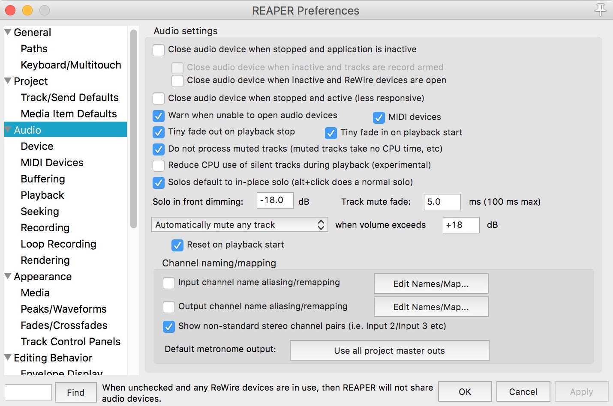

# 9. Problèmes connus et avertissements

Il y a tellement de situations et de configurations différentes qu'il
nous serait impossible de les couvrir toutes. Jusqu'à présent, nous
n'avons trouvé aucune situation où le système ne fonctionne pas du tout.
Mais nous avons trouvé des situations où certains paramètres doivent
être ajustés avant que le système puisse fonctionner correctement. En
voici quelques-unes.

## 9.1. Problèmes connus

### 9.1.1. SpatGRIS, le plugiciel et SpatGRIS, le logiciel

Pour ceux qui ont utilisé le plugiciel *SpatGRIS*, vous remarquerez
qu'il ne fonctionne plus sur les plus récents systèmes macOS et sur les
ordinateurs Apple Silicon. Nous recommandons de passer à *ControlGRIS2*.
Le développement de *SpatGRIS1* s'est terminé en 2018.

### 9.1.2.

### 9.1.3.

## 9.2. Reaper

### 9.2.1. Pistes mono

• Créez une piste et insérez-y une instance de *ControlGRIS2* et un
fichier audio mono.

• Cliquez sur le bouton Route situé à droite du bouton de réglage du
gain de la piste.

• Dans la fenêtre qui s'ouvre, décochez Master send.

• En bas à gauche de cette même fenêtre, cliquez sur le bouton Add new
hardware sortie... (Ajouter une nouvelle sortie matérielle).

• Tout en bas de la liste des sorties de l'interface de sortie se
trouvent les sorties individuelles mono.

• Sélectionnez la sortie qui correspond au numéro attribué à la source
dans *ControlGRIS2*.

Il n'est pas nécessaire de panoramiser les sources monos vers la gauche
pour les pistes impaires et vers la droite pour les pistes paires,
puisque les sorties matérielles monos de Reaper sont utilisées. De plus,
la piste Master de Reaper est actuellement limitée à 128 canaux, il est
donc pratique d'utiliser les sorties matérielles de Reaper directement
comme décrit.

### 9.2.2. Préférences avec Jack

Dans les Préférences de Reaper, sous l'onglet Audio : décocher "Close
audio device when stopped and application is inactive". Sinon, *Jack*
perdra le contact avec Reaper lorsqu'il est inactif, et le système ne
fonctionnera jamais.

## 9.3. Logic Pro

### 9.3.1. Une seule sortie Surround

Dans Logic Pro, il n'y a qu'une seule instance Surround possible. Cela
signifie qu'il n'est pas possible d'avoir plusieurs pistes multicanaux
dans Logic tout en utilisant *SpatGRIS*. Pour éviter cette restriction,
n'utilisez que des pistes mono et stéréo dans Logic.

### 9.3.2. Bouton Activate

Lorsque vous utilisez les trajectoires prédéfinies de *ControlGRIS2*, il
y a une exception concernant le bouton Activate dans Logic Pro. S'il n'y
a plus d'audio dans la piste à la position d'arrêt, le bouton Activate
ne s'éteindra pas. Il devra être désactivé manuellement.

## 9.4. Digital Performer 11 et automatisation des mémoires

L'automatisation des mémoires enregistrées dans DP présentent des
courbes lisses au lieu des courbes carrées attendues. Cela signifie que
le passage d'une mémoire automatisée à une autre est progressif, alors
qu'on s'attend à ce qu'il soit discret. Nous y travaillons.

## 9.5. Utilisation de SpatGRIS avec des entrées en direct

Dans le cas de l'utilisation d'entrées en direct, nous recommandons
l'utilisation du périphérique agrégé sur un Mac. D'après nos tests, le
système est stable lorsqu'on crée un périphérique agrégé comprenant
*BlackHole* et la carte son que vous utilisez. Ce périphérique agrégé
doit être désigné comme périphérique d'entrée et de sortie audio dans
votre SAN et comme périphérique d'entrée et de sortie audio dans
SpatGRIS.

Pour la numérotation des canaux, veuillez vous référer à l'application
Audio / Midi Configuration sur votre Mac une fois que vous avez créé
votre périphérique agrégé. En plaçant votre carte son physique comme
premier élément de périphérique, vous n'aurez pas besoin de modifier la
numérotation des configurations de haut-parleurs. Ce flux de travail a
été testé avec Ableton Live.

Pour une utilisation sous Windows, l'utilisation de Jack semble
suffisante, mais nous ne l'avons pas testé de manière approfondie.

NOTE : Ajustez la taille de la mémoire tampon à la même valeur dans
votre SAN et dans *SpatGRIS*. Une valeur de 256 et plus est recommandée.
