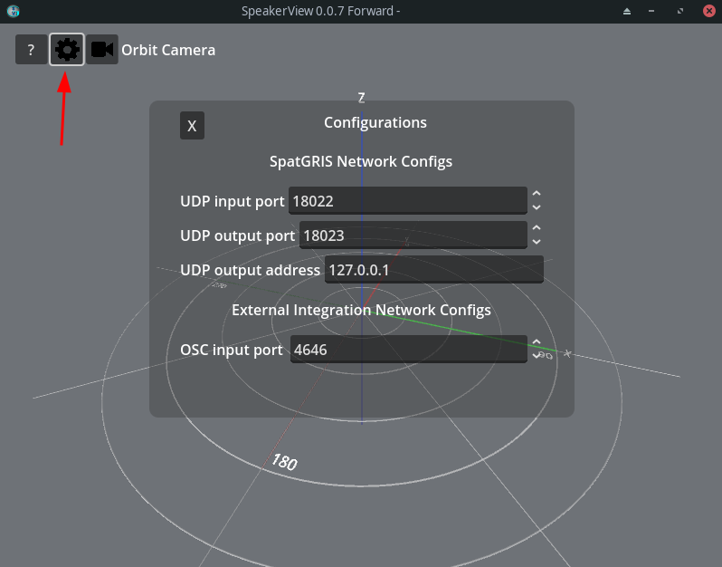
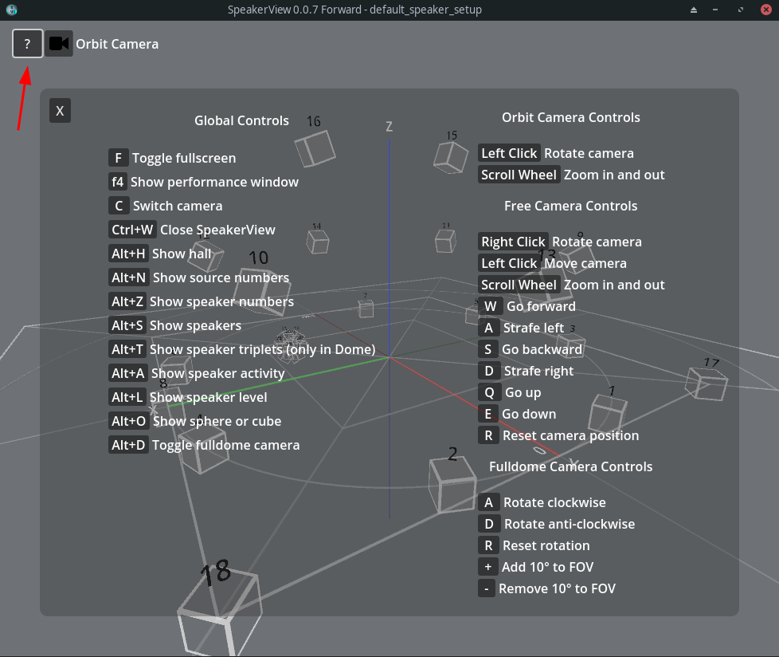
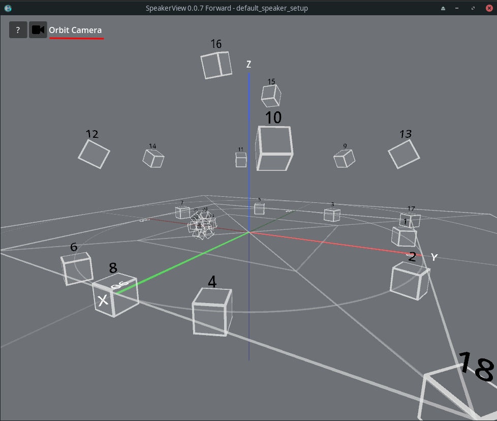
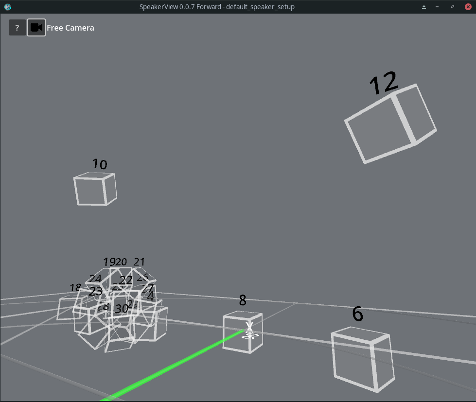
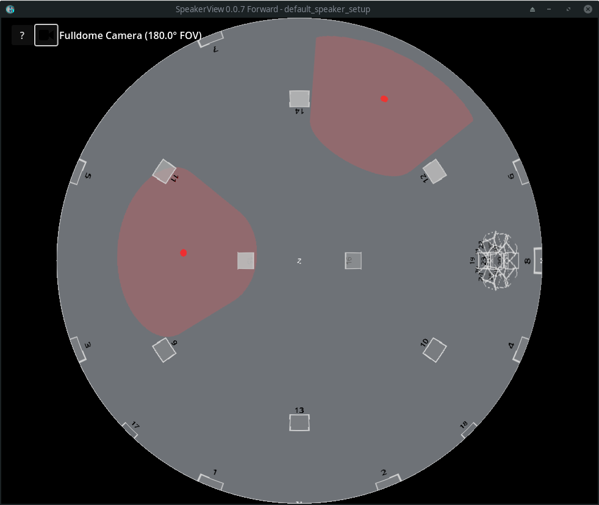

# SpeakerView

**SpeakerView** Est une application permettant de visualiser en trois dimensions les "speaker setup" de la suite de logiciels du GRIS.

SpeakerView est utilisé comme outil de monitoring pour la conception d'environnements complexe pour l'audio spatialisé. Grace à lui, l'utilisateur peut confirmer visuellement que les emplacements des haut-parleurs définis dans un "speaker setup" correspondent à ceux de l'espace réel.

Il est aussi possible d'y visualiser le positionnement et l'activité des sources sonores dans l'espace.

## Modes d'opérations

### Utilisation avec SpatGRIS

Dans les cas d'usages les plus communs, SpeakerView sera lancé automatiquement par SpatGRIS à l'ouverture.

### Standalone

Il est aussi possible d'utiliser SpeakerView comme une application indépendante à laquelle il est possible d'envoyer des données par réseau. Il est possible de cette manière de monitorer une session SpatGRIS roulant sur une autre machine sur le réseau.

Lorsque SpeakerView tourne en mode "standalone", un menu de configuration additionel est affiché. Dans celui-ci vous pouvez modifier les configurations réseau suivantes.

- **Ports UDP d'entrée et de sortie**: Ces ports servent à communiquer avec SpatGRIS. 18022 et 18023 sont les valeurs par défaut.
- **Adresse de sortie UDP**: L'adresse IP de l'instance de SpatGRIS avec laquelle vous voulez connecter SpeakerView
- **OSC input port** : Le port sur lequel SpeakerView écoute les messages OSC entrants. 4646 par default.

En plus des messages UDP de SpatGRIS, SpeakerView accepte les messages OSC aux formats suivants :

- /**control**/show\_source\_numbers
- /control/show\_speaker\_numbers
- /control/spat\_mode
- /**source**/{id}/color
- /source/{id}/position
- /**speaker**/{id}/position
- ….

Il est donc possible d'utiliser le protocole OSC pour utiliser SpeakerView comme visualisateur d'un autre système de spatialisation que SpatGRIS

## Contrôles

Le menu d'aide de SpatGRIS expose toutes les commandes de navigation et de configuration.

## Caméras

SpeakerView inclu plusieurs modes de caméra pour vous permettre de visualiser la zone de l'espace qui vous intéresse.

Il est à noter que les positions de chaque caméra sont indépendantes et sont sauvegardées et restorées lorsque vous changez d'une caméra à l'autre.

Le bouton caméra permet d'alterner entre la caméra orbitale et la caméra libre. La caméra fulldome est moins généralement utile, il est possible d'y accéder grâce à un raccourci clavier.

### Caméra orbitale

La caméra orbitale est la caméra par défaut. Cette caméra permet de tourner autour du centre de l'espace et de zoomer/dézoomer.

### Caméra libre

La caméra libre permet de déplacer librement la caméra dans l'espace à l'aide des touches W, A, S, D, Q et E ainsi qu'avec la souris.

### Caméra fulldome

Si vous avez accès à un dôme qui inclus de la projection, vous pourrez utiliser la caméra fulldome pour que SpeakerView afficher l'espace au format [dome master](https://imersa.org/images/standards/Dome_Master_Specifications_2019.pdf). De cette manière il vous sera possible de visualiser les haut parleurs et les sources à même l'espace de diffusion.

À l'aide des touches + et - vous pouvez définir le FOV (field of view) par incréments de 10 degrés pour ajuster la vue à la surface de projection du dôme. Vous pouvez aussi ajuster la rotation de la caméra avec les touches a et d.

